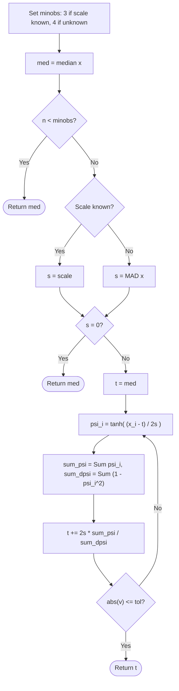
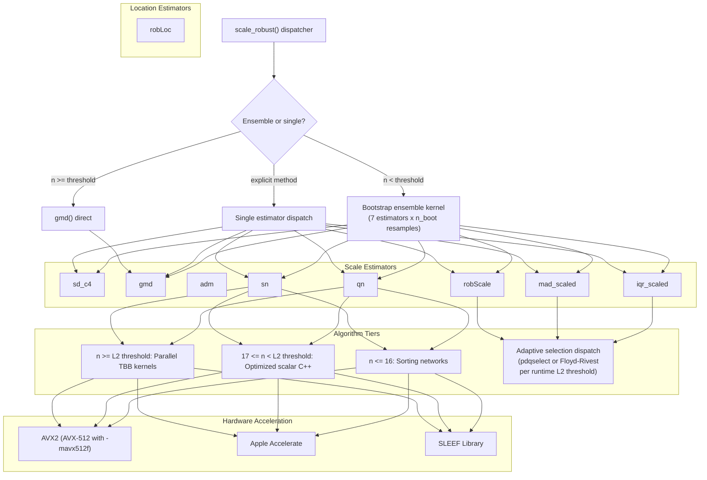

# robscale: A Comprehensive Toolkit for Robust Scale Estimation


[](https://doi.org/10.5281/zenodo.18828607)

## Overview

Outliers compromise the reliability of classical estimators even in
moderate samples. A single recording error can destroy the standard
deviation, yet the most widely used robust implementations in R—`revss`
for small-sample M-estimation and `robustbase` for the $\`Q_n\`$ and $\`S_n\`$
scale estimators—carry significant computational overhead for
time-critical applications.

`robscale` v0.2.0 provides 11 exported functions spanning the full
robustness–efficiency spectrum: from the non-robust but maximally
efficient bias-corrected standard deviation (`sd_c4`, 100% ARE) through
the Gini mean difference (`gmd`, 98% ARE, 29.3% breakdown), to
maximum-breakdown estimators (`qn`, `sn`, `mad_scaled`, all 50%
breakdown). The unified `scale_robust()` dispatcher selects the
appropriate strategy—a variance-weighted bootstrap ensemble of all 7
estimators for small samples, with an automatic switch to the GMD for
large samples. All scale estimators support analytical or bootstrap
confidence intervals via `ci = TRUE`.

All estimators are implemented as C++17 kernels. The M-estimators use
vectorized `tanh` evaluation (where batch sizes justify the overhead)
and Newton–Raphson iteration; $\`Q_n\`$ and $\`S_n\`$ use parallelized
$\`O(n \log n)\`$ algorithms via TBB. Against `revss`, the package achieves
**10.3–30.0x** speedups for the small-sample M-estimators. Against
`robustbase`, it achieves **1.9–10.1x** for $\`S_n\`$ and **1.8–7.0x** for
$\`Q_n\`$—with gains peaking near **10.1x** at $\`n = 10^7\`$ as TBB parallelism
reduces the computational bottleneck for massive datasets. The new
estimators (`gmd`, `iqr_scaled`, `mad_scaled`) outperform their base R
and CRAN counterparts by **2.6–16.3x** (GMD vs `Hmisc`), **3.0–26.4x**
(IQR vs `stats::IQR`), and **2.8–19.1x** (MAD vs `stats::mad`).

## Installation

``` r
install.packages("robscale")

# Development version:
# install.packages("remotes")
# remotes::install_github("davdittrich/robscale")
```

## Motivating example

``` r
library(robscale)

x <- c(2.0, 3.1, 2.7, 2.9, 3.3)   # clean measurements

# Recommended entry point: scale_robust()
scale_robust(x)                      # ensemble (small n < 20)
scale_robust(rnorm(50))              # auto-switches to gmd (n >= 20)

# Individual estimators span the robustness-efficiency frontier
gmd(x)                               # 98% ARE, 29.3% breakdown
qn(x)                                # 82.3% ARE, 50% breakdown
mad_scaled(x)                        # 36.8% ARE, 50% breakdown

# Confidence intervals
qn(x, ci = TRUE)                     # point estimate + 95% CI
gmd(x, ci = TRUE, level = 0.99)      # 99% CI

# Outlier resistance
x[5] <- 100                          # recording error
sd(x)                                # destroyed
gmd(x)                               # stable (29.3% breakdown)
qn(x)                                # stable (50% breakdown)
mad_scaled(x)                        # stable (50% breakdown)
```

For small samples ($\`n < 20\`$), `scale_robust()` combines all 7 estimators
via a variance-weighted bootstrap ensemble, giving each estimator
influence proportional to its precision. For larger samples, it
automatically switches to the GMD, which achieves 98% ARE at negligible
computational cost.

## API reference

<div id="tbl-api-scale">

Table 1

**Table 1: Scale estimators** (sorted by decreasing ARE)

| Function | Purpose | ARE | Breakdown | Complexity | Reference |
|:---|:---|:---|:---|:---|:---|
| `sd_c4(x)` | Bias-corrected standard deviation | **100%** | 0% | $\`O(n)\`$ | Welford (1962) |
| `gmd(x)` | Gini mean difference | **98%** | 29.3% | $\`O(n \log n)\`$ | Gini (1912); Nair (1936) |
| `adm(x)` | Average deviation from median | **88.3%** | $\`1/n\`$ | $\`O(n)\`$ | Nair (1947) |
| `qn(x)` | $\`Q_n\`$ scale estimator | **82.3%** | 50% | $\`O(n \log n)\`$ | Rousseeuw & Croux (1993) |
| `sn(x)` | $\`S_n\`$ scale estimator | **58.2%** | 50% | $\`O(n \log n)\`$ | Rousseeuw & Croux (1993) |
| `robScale(x)` | M-estimate of scale | **55.0%** | 50% | $\`O(n)\`$ iters | Rousseeuw & Verboven (2002) |
| `iqr_scaled(x)` | Scaled interquartile range | **37%** | 25% | $\`O(n)\`$ | Bickel & Lehmann (1976) |
| `mad_scaled(x)` | Scaled median absolute deviation | **36.8%** | 50% | $\`O(n)\`$ | Rousseeuw & Croux (1993) |

</div>

At the top of this spectrum, `sd_c4` retains full efficiency but
collapses under a single outlier. The `gmd` occupies the practical sweet
spot: 98% efficiency with 29.3% breakdown—sufficient for most
contamination levels. For adversarial settings where breakdown must be
maximized, `qn` provides the best combination of high breakdown (50%)
and high efficiency (82.3%).

<div id="tbl-api-dispatch">

Table 2

**Table 2: Dispatcher and utilities**

| Function | Purpose |
|:---|:---|
| `scale_robust(x)` | Unified dispatcher: ensemble for small $\`n\`$, auto-switches to GMD for large $\`n\`$ |
| `get_consistency_constant(method, n)` | Returns the consistency constant or finite-sample correction for a given estimator |

</div>

Additionally, `robLoc(x)` provides an M-estimate of location (98.4% ARE,
50% breakdown; Rousseeuw & Verboven 2002). All functions accept `na.rm`
(default `FALSE`). Most scale estimators accept `ci = FALSE` and
`level = 0.95`; when `ci = TRUE`, they return an object of class
`"robscale_ci"` containing the point estimate and a confidence interval
(analytical for individual estimators, bootstrap for `scale_robust()`).
The exceptions are `adm()` and `robLoc()`, which do not support
confidence intervals.

### `sd_c4(x, na.rm = FALSE, ci = FALSE, level = 0.95)`

Computes the sample standard deviation corrected by $\`c_4(n)\`$ to remove
the small-sample bias of the square-root estimator:

$$
\hat\sigma = \frac{s}{c_4(n)} = \frac{s}{\sqrt{2/(n{-}1)} \cdot \Gamma(n/2) / \Gamma((n{-}1)/2)}
$$

where $\`s\`$ is the usual sample standard deviation. Uses Welford’s online
algorithm for numerically stable variance computation, avoiding
catastrophic cancellation. This is a non-robust estimator (0% breakdown)
with 100% ARE by construction—it serves as the efficiency anchor in the
ensemble.

``` r
sd_c4(c(1, 2, 3, 5, 7, 8))
```

### `gmd(x, constant = 0.886226925452758, na.rm = FALSE, ci = FALSE, level = 0.95)`

Computes the Gini mean difference (Gini, 1912), scaled by a consistency
constant for asymptotic normality under the Gaussian model:

$$
\text{GMD}(x) = C \cdot \frac{2}{n(n{-}1)}\sum_{i=1}^{n} (2i - n - 1)\, x_{(i)}
$$

where $\`x_{(1)} \le \ldots \le x_{(n)}\`$ are the order statistics and
$\`C = \sqrt{\pi}/2 \approx 0.8862\`$. The computation requires a full sort
($\`(O(n \log n))\`$), with sorting networks applied for $\`n \le 16\`$.

The GMD achieves **98% ARE** (Nair, 1936) with a **29.3% breakdown
point**, making it the most statistically efficient robust alternative
in this package. It is the estimator `scale_robust()` auto-switches to
for large samples.

``` r
gmd(c(1, 2, 3, 5, 7, 8))
gmd(c(1, 2, 3, 5, 7, 8), constant = 1)   # raw (unscaled)
```

### `adm(x, center, constant = 1.2533141373155001, na.rm = FALSE)`

Computes the mean absolute deviation from the median, scaled by a
consistency constant for asymptotic normality under the Gaussian model:

$$
\text{ADM}(x) = C \cdot \frac{1}{n}\sum_{i=1}^{n} |x_i - \text{med}(x)|
$$

where $\`C = \sqrt{\pi/2} \approx 1.2533\`$ (Nair, 1947). When `center` is
supplied, it replaces the median. The ADM achieves **88.3% ARE** but
breaks down at a single outlier ($\`1/n\`$ breakdown point). It serves as
the fallback scale estimator when the MAD collapses to zero.

``` r
adm(c(1, 2, 3, 5, 7, 8))
adm(c(1, 2, 3, 5, 7, 8), constant = 1)   # without consistency correction
```

### `robLoc(x, scale = NULL, na.rm = FALSE, maxit = 80L, tol = sqrt(.Machine$double.eps))`

M-estimator for location defined by the logistic psi function (Rousseeuw
& Verboven 2002, Eq. 21), solved via Newton–Raphson iteration. Starting
value: $\`T^{(0)} = \text{median}(x)\`$. Auxiliary scale:
$\`S = \text{MAD}(x)\`$ (or the user-supplied `scale`). See [Methodological
enhancements](#methodological-enhancements) for the iteration formula.

**Fallback logic:** When `scale` is unknown and $\`n < 4\`$, or when `scale`
is known and $\`n < 3\`$, the function returns `median(x)` without
iteration. Providing a known `scale` lowers the minimum sample size from
4 to 3 because the MAD (which is unreliable at $\`n = 3\`$) is no longer
needed. The flowchart below shows the full control flow including
fallbacks and the Newton–Raphson loop.

``` r
robLoc(c(1, 2, 3, 5, 7, 8))
robLoc(c(1, 2, 3), scale = 1.5)   # known scale enables n = 3
```



### `robScale(x, loc = NULL, fallback = c("adm", "na"), implbound = 1e-4, na.rm = FALSE, maxit = 80L, tol = sqrt(.Machine$double.eps), ci = FALSE, level = 0.95)`

M-estimator for scale using multiplicative iteration with the rho
function—the square of the logistic psi (Rousseeuw & Verboven 2002, Eq.
27):

$$
S^{(k)} = S^{(k-1)} \cdot \sqrt{2 \cdot \frac{1}{n}\sum \psi_{\log}^2\!\left(\frac{x_i - T}{c \cdot S^{(k-1)}}\right)}
$$

where $\`c = 0.37394112142347236\`$ and $\`T = \text{median}(x)\`$ is held
fixed. Starting value: $\`S^{(0)} = \text{MAD}(x)\`$.

**Degenerate input handling:** When the sample size falls below the
minimum for iteration (4 for unknown location, 3 for known), the
function returns the initial MAD-based scale directly if it is nonzero.
When the MAD collapses to zero (i.e. MAD $\`\leq\`$ `implbound`), the
`fallback` argument controls the result:

- `fallback = "adm"` (Default): returns `adm(x)`, maintaining a finite
  robust estimate where standard scale measures fail.
- `fallback = "na"`: returns `NA`, strictly matching the behavioral
  profile of the `revss` package.

Providing a known `loc` centers the data at that value and uses the
median-distance-to-zero ($\`(1.4826 \cdot \text{median}(|x_i - \mu|))\`$) as
the initial scale, lowering the minimum sample size from 4 to 3. The
flowchart below illustrates the control flow, including the `fallback`
logic and SIMD-accelerated loop.

``` r
robScale(c(1, 2, 3, 5, 7, 8))
robScale(c(5, 5, 5, 5, 6), fallback = "na")   # returns NA (revss compatibility)
```


### `qn(x, constant = 2.2191, finite.corr = TRUE, na.rm = FALSE, ci = FALSE, level = 0.95)`

Computes the $\`Q_n\`$ estimator of scale (Rousseeuw & Croux, 1993). Unlike
M-estimators, $\`Q_n\`$ requires no location estimate and achieves a 50%
breakdown point. `robscale` implements $\`Q_n\`$ with a tiered strategy: a
brute-force exact algorithm for small $\`n\`$ (below `qn_exact_threshold`)
and a cache-aware parallelized Johnson-style algorithm for larger
samples.

``` r
qn(c(1, 2, 3, 5, 7, 8))
qn(c(1, 2, 3, 5, 7, 8), ci = TRUE)   # with 95% CI
```

### `sn(x, constant = 1.1926, finite.corr = TRUE, na.rm = FALSE, ci = FALSE, level = 0.95)`

Computes the $\`S_n\`$ estimator of scale (Rousseeuw & Croux, 1993). $\`S_n\`$
is more statistically efficient than the MAD and maintains a 50%
breakdown point. `robscale` uses optimal sorting networks for $\`n \le 16\`$
and a highly optimized parallelized inner-median algorithm for general
samples.

``` r
sn(c(1, 2, 3, 5, 7, 8))
sn(c(1, 2, 3, 5, 7, 8), ci = TRUE)   # with 95% CI
```

### `iqr_scaled(x, constant = 0.741301109252801, na.rm = FALSE, ci = FALSE, level = 0.95)`

Computes the interquartile range scaled by a consistency constant for
asymptotic normality under the Gaussian model:

$$
\text{IQR}_s(x) = C \cdot (Q_{0.75} - Q_{0.25})
$$

where $\`Q_p\`$ denotes the Type 7 quantile (R default) and
$\`C = 1/(\Phi^{-1}(0.75) - \Phi^{-1}(0.25)) \approx 0.7413\`$ (Bickel &
Lehmann, 1976). Unlike `stats::IQR()`, which requires a full
$\`O(n \log n)\`$ sort, this implementation uses dual $\`O(n)\`$ pdqselect
calls—one per quartile—and exploits the $\`Q_1\`$ partition to narrow the
$\`Q_3\`$ search, providing a substantial speedup for large datasets. The
IQR achieves **37% ARE** with a **25% breakdown point**.

``` r
iqr_scaled(c(1, 2, 3, 5, 7, 8))
iqr_scaled(c(1, 2, 3, 5, 7, 8), constant = 1)   # raw IQR
```

### `mad_scaled(x, center, constant = 1.482602218505602, na.rm = FALSE, ci = FALSE, level = 0.95)`

Computes the median absolute deviation from the median, scaled by a
consistency constant for asymptotic normality:

$$
\text{MAD}_s(x) = C \cdot \text{med}_i\, |x_i - \text{med}(x)|
$$

where $\`C = 1/\Phi^{-1}(3/4) \approx 1.4826\`$. Unlike `stats::mad()`, this
implementation uses adaptive $\`O(n)\`$ selection (Floyd–Rivest below a
cache-derived threshold, pdqselect above) with sorting networks for
$\`n \le 16\`$, avoiding a full sort. The MAD achieves **36.8% ARE**
(Rousseeuw & Croux, 1993: “about 37%”) with a **50% breakdown point**.

``` r
mad_scaled(c(1, 2, 3, 5, 7, 8))
mad_scaled(c(1, 2, 3, 5, 7, 8), constant = 1)   # raw MAD
```

### `scale_robust(x, method = c("ensemble", "gmd", "sd", "mad", "iqr", "sn", "qn", "robScale"), auto_switch = TRUE, threshold = 20L, n_boot = 200L, na.rm = FALSE, ci = FALSE, level = 0.95, boot_method = c("auto", "bca", "percentile", "parametric"))`

Unified dispatcher for robust scale estimation. Operates in three modes:

1.  **Ensemble** (default, `method = "ensemble"`): variance-weighted
    combination of all 7 scale estimators via bootstrap resampling.
2.  **Auto-switch** (`auto_switch = TRUE`, default): when $\`n \ge\`$
    `threshold` (default 20), returns `gmd(x)` directly—the most
    efficient robust estimator at negligible cost.
3.  **Explicit method**: dispatches to a specific estimator by name.

When `ci = TRUE`, the ensemble and auto-switch modes use bootstrap
confidence intervals (BCa by default); explicit single-method dispatch
uses analytical intervals based on each estimator’s asymptotic relative
efficiency.

``` r
scale_robust(c(1, 2, 3, 5, 7, 8))           # ensemble (n < 20)
scale_robust(rnorm(50))                       # auto-switches to gmd
scale_robust(rnorm(50), auto_switch = FALSE)  # forces ensemble
scale_robust(rnorm(50), method = "qn")        # explicit Qn
scale_robust(c(1, 2, 3, 5, 7, 8), ci = TRUE) # ensemble + bootstrap CI
```


The ensemble combines: `sd_c4`, `gmd`, `mad_scaled`, `iqr_scaled`, `sn`,
`qn`, and `robScale`. Bootstrap resampling uses a deterministic
XorShift32 PRNG seeded by replicate index, ensuring reproducible results
without requiring `set.seed()`.

Note: the method name `"sd"` maps to `sd_c4`.

### `get_consistency_constant(method, n = NULL)`

Returns the consistency constant (or finite-sample correction factor)
used to make a given estimator consistent for the population standard
deviation under normality. Supported `method` values: `"c4"`, `"gmd"`,
`"mad"`, `"iqr"`, `"sn"`, `"qn"`.

When `n = NULL`, the function returns the asymptotic consistency
constant. When `n` is supplied, it returns the finite-sample correction
factor for that sample size—useful for small-sample bias (for $\`n\`$)
correction.

``` r
get_consistency_constant("mad")          # asymptotic: 1/qnorm(3/4)
get_consistency_constant("qn", n = 10)  # finite-sample correction at n = 10
```

## Methodological enhancements

`robscale` implements the estimators defined by Rousseeuw & Verboven
(2002) and Rousseeuw & Croux (1993). It produces identical numerical
results to `revss` and `robustbase`, but its computational strategies
significantly cut run times across all sample sizes.

### 1. The tanh identity for the logistic psi function

The logistic psi function central to both M-estimators is:

$$
\psi_{\log}(x) = \frac{e^x - 1}{e^x + 1}
$$

`revss` evaluates this as `2 * plogis(u) - 1`, which calls R’s `plogis`
(the logistic CDF $\`1/(1 + e^{-x})\`$). The computation requires one call
to `exp()` followed by two arithmetic operations, plus the overhead of
R’s vectorised dispatch, intermediate vector allocation, and
garbage-collection pressure.

The algebraic identity

$$
\psi_{\log}(x) = \tanh(x/2)
$$

is immediate from the definition of the hyperbolic tangent. `robscale`
exploits this identity to reduce $\`\psi_{\log}\`$ to a single `tanh` call.
The identity is not merely a cosmetic rewrite:

- **Branch elimination.** A direct implementation of
  $\`(e^x - 1)/(e^x + 1)\`$ overflows for large $\`|x|\`$, requiring a
  sign-based branch to keep intermediate values bounded. The `tanh`
  function handles this internally with a single code path.

- **Platform vectorization.** `robscale` uses platform-specific
  libraries to evaluate `tanh` in bulk. The implementation ranks and
  selects the fastest available backend:

  1.  **Apple Accelerate.** On macOS (Darwin), it uses `vvtanh` for
      array-wide SIMD processing.
  2.  **SLEEF.** On Linux (x86_64), it uses the SLEEF library to target
      AVX2 instruction sets (AVX512 is reachable only if compiled with
      `-mavx512f`, which CRAN builds do not set). On macOS, this backend
      is explicitly disabled in favor of Apple Accelerate.
  3.  **OpenMP SIMD.** A compiler-guided fallback via
      `#pragma omp simd`.
  4.  **Scalar.** Standard `std::tanh` fallback.

For $\`n \leq 64\`$ the vectorized paths are bypassed in favour of a simple
scalar loop—the setup overhead exceeds any SIMD benefit at that batch
size. SIMD acceleration therefore applies to the scale iteration for
larger samples, not the small-sample M-estimator regime (which targets
$\`n \leq 20\`$).

### 2. Newton–Raphson iteration for location

`revss` iterates the location estimator using the scoring fixed-point
iteration (Rousseeuw & Verboven 2002, Eq. 21):

$$
T^{(k+1)} = T^{(k)} + S \cdot \frac{\frac{1}{n}\sum \psi_{\log}\!\left(\frac{x_i - T^{(k)}}{S}\right)}{\alpha}
$$

where $\`\alpha = \int \psi_{\log}'(u)\,d\Phi(u) \approx 0.4132\`$ is the
normalization constant. This is a fixed-point iteration with *linear*
convergence: each step reduces the error by a constant factor.

`robscale` instead applies Newton–Raphson to the estimating equation
$\`\sum \psi_{\log}((x_i - T)/S) = 0\`$, yielding:

$$
T^{(k+1)} = T^{(k)} + \frac{2\,S\sum \psi\!\left(\frac{x_i - T^{(k)}}{2S}\right)}
{\sum \left[1 - \psi^2\!\left(\frac{x_i - T^{(k)}}{2S}\right)\right]}
$$

where $\`\psi(\cdot) = \tanh(\cdot)\`$. The efficiency follows from
observing that the derivative of the logistic psi satisfies
$\`\psi_{\log}'(x) = 1 - \psi_{\log}^2(x) = 1 - \tanh^2(x/2)\`$. Since
$\`\tanh\`$ values have already been computed for the numerator, the
denominator requires only squaring and subtraction—no additional
transcendental function calls.

Newton–Raphson achieves *quadratic* convergence near the solution: the
number of correct digits approximately doubles per iteration. The
practical effect is a reduction from 4–8 iterations (scoring) to 3
iterations (Newton–Raphson) for reaching the same tolerance of
$\sqrt{\epsilon_{\text{mach}}} \approx 1.49
\times 10^{-8}$:

| $\`n\`$ | Scoring iterations | Newton–Raphson iterations |
|----:|-------------------:|--------------------------:|
|   4 |                  7 |                         3 |
|   5 |                  8 |                         3 |
|   8 |                  7 |                         3 |
|  20 |                  6 |                         3 |
| 100 |                  5 |                         3 |

At small $\`n\`$, the scoring iteration count is higher because the starting
value (the median) can be far from the M-estimate in units of the
auxiliary scale. Newton–Raphson absorbs this gap in fewer steps.

### 3. $\`O(n)\`$ median selection

Both the median and the MAD require computing a quantile—the median of
the data, and the median of the absolute deviations. `revss` uses R’s
`median()` and `mad()`, which call `sort()` internally: an $\`O(n \log n)\`$
operation.

`robscale` uses a tiered $\`O(n)\`$ median selection strategy. For even $\`n\`$,
a single linear scan over the upper partition locates the $\`(k{+}1)\`$-th
element needed for averaging.

For $\`n \leq 16\`$—the core target regime—the selection step uses optimal
sorting networks (Knuth, TAOCP Vol. 3, Sec. 5.3.4; Dobbelaere’s verified
optimal networks for $\`n = 9\`$ to $\`16\`$). These are conditional
compare-and-swap sequences—typically compiled to branchless machine code
at `-O2`—with the minimum number of comparisons for each $\`n\`$:

| $\`n\`$ | Comparators |
|----:|------------:|
|   3 |           3 |
|   4 |           5 |
|   5 |           9 |
|   6 |          12 |
|   7 |          16 |
|   8 |          19 |
|   9 |          25 |
|  10 |          29 |
|  11 |          35 |
|  12 |          39 |
|  13 |          45 |
|  14 |          51 |
|  15 |          56 |
|  16 |          60 |

Cross-platform benchmarking confirmed 2 to 4$\`\times\`$ speedups over
`std::sort` for $\`n = 9\`$ to $\`16\`$ on both ARM64 (Apple Silicon) and x86_64
(AMD Zen 3).

For $\`17 \leq n < 600\`$, the code delegates to `std::nth_element`
(introselect), which provides $\`O(n)\`$ worst-case selection with
median-of-three pivot selection. For $\`n \geq 600\`$, the Floyd–Rivest
algorithm (Floyd & Rivest, 1975) applies a statistical narrowing step
that reduces the active window to $\`O(n^{2/3})\`$ elements before
partitioning—a constant-factor improvement that amortizes the overhead
of its `log`/`exp`/`sqrt` computation only at scale.

Several estimators use an adaptive selection strategy that switches
between Floyd–Rivest and pdqselect (miniselect) based on a runtime
threshold derived from the per-core L2 cache size. Section 9 describes
this dispatch in detail.

### 4. Arena allocation on the stack

Each estimator requires working arrays: a copy of the input (for
destructive selection), absolute deviations (for MAD), and a temporary
buffer (for bulk `tanh` arguments). `revss` allocates these as R
vectors, incurring R’s SEXPREC header overhead and adding
garbage-collection pressure.

`robscale` uses a tiered stack-allocated arena: a 128-double
micro-buffer for $\`n \leq 64\`$ and a 2,048-double buffer per array for
$\`n \leq 2{,}048\`$ (the MAD and M-estimator paths)—which covers the target
regime and far beyond—with zero heap allocation. For $\`n > 2{,}048\`$, the
code falls back to `new[]`/`delete[]`. IQR uses a larger 4,096-element
stack owing to its single working array and wider operational range.

### 5. Compile-time reciprocal constants

The constants $\`1/\alpha = 1/0.413241928283814\`$ and
$\`1/c = 1/0.37394112142347236\`$ are declared `constexpr`, allowing the
compiler to replace divisions in the iteration loop with
multiplications. On ARM64, this avoids the ~10-cycle `fdiv` instruction
in favour of a ~3-cycle `fmul`.

### 6. Loop-invariant hoisting

Values that are constant across iterations—`inv_s = 1.0 / s`,
`half_inv_s = 0.5 / s`, `inv_n = 1.0 / n`—are computed once before the
loop. The `revss` implementation recomputes `(x - t) / s` as a fresh R
vector each iteration, traversing the interpreter for every vectorised
operation.

### 7. $\`Q_n\`$ and $\`S_n\`$ algorithm optimizations

`robustbase` implements $\`Q_n\`$ and $\`S_n\`$ in R-wrapped Fortran (Maechler
et al.), which incurs R dispatch overhead for every inner-loop call.
`robscale` replaces these paths entirely with a self-contained C++17
implementation.

**$\`Q_n\`$ — tiered exact/approximate algorithm.** For small $\`n\`$ (below a
compile-time threshold), `robscale` enumerates all $\`\binom{n}{2}\`$
pairwise absolute differences, selects the $\`h\`$th order statistic with
Floyd–Rivest, and applies the finite-sample correction factor. For
larger $\`n\`$, it uses a parallel Johnson-style algorithm:

1.  **Sort** the data in $\`O(n \log n)\`$.
2.  **Count and bound** — two parallel workers (`QnCountWorker`,
    `QnRefineWorker`) scan the sorted array to count and bracket the
    number of pairs above/below a trial value, using TBB
    `parallel_reduce` and `parallel_for`.
3.  **Weighted median of inner values** — a weighted-median step
    (`whimed_cpp`) refines the bracket; iterations continue until the
    bracket width falls below $\`n\`$.
4.  **Final brute-force** — the residual window is enumerated and
    Floyd–Rivest selects the exact $\`k\`$th difference.

This structure avoids materializing all $\`O(n^2)\`$ pairs and runs at
$\`O(n \log n)\`$ per iteration, with parallelism scaling across all
available cores for $\`n \geq\`$ `qn_parallel_threshold`.

**$\`S_n\`$ — parallelized inner-median sweep.** The $\`S_n\`$ statistic is the
low median of the vector $\`\{\text{med}_j |x_i - x_j|\}_{i=1}^n\`$.
`robscale` computes each inner median with an initial binary search
seeding a sliding-window linear scan (exploiting sortedness) in
amortized $\`O(1)\`$ per element, then dispatches the outer $\`n\`$ iterations
across TBB threads via `SnWorker`. For $\`n \leq 2048\`$, a stack-allocated
arena avoids heap allocation entirely.

### 8. Welford’s algorithm for numerical stability

The `sd_c4()` estimator uses Welford’s (1962) one-pass online algorithm
for computing variance. The standard two-pass formula
$s^2 = \frac{1}{n-1}\sum(x_i -
\bar{x})^2$\` suffers from catastrophic cancellation when \`$\sum x_i^2$ and
$\`n\bar{x}^2\`$ are close. Welford’s algorithm incrementally updates mean
and sum-of-squares-of-differences, maintaining full precision with a
single pass:

$$
\delta_i = x_i - \bar{x}_{i-1}, \quad \bar{x}_i = \bar{x}_{i-1} + \delta_i / i, \quad M_{2,i} = M_{2,i-1} + \delta_i(x_i - \bar{x}_i)
$$

### 9. Adaptive selection dispatch

Several estimators require $\`O(n)\`$ selection (median, low-median, or
arbitrary $\`k\`$th-order statistic). At moderate $\`n\`$, Floyd–Rivest’s
statistical narrowing step wins; at large $\`n\`$, pdqselect’s
pattern-defeating properties and cache locality dominate. The crossover
depends on the number of warm arrays competing for L2 cache during
selection, so each estimator uses its own runtime threshold derived from
the per-core L2 cache size:

| Estimator | Dispatch | Threshold formula | Divisor |
|:---|:---|:---|---:|
| `iqr_scaled` | Always pdqselect | — | — |
| `mad_scaled` | `adaptive_median_select` | $\`\max(2048,\; L_2 / (8 \times 5))\`$ | 5 |
| `robScale` | `adaptive_robscale_median_select` | $\`\max(2048,\; L_2 / (8 \times 2))\`$ | 2 |
| $\`S_n\`$ | `adaptive_lowmedian_select` | $\`\max(2048,\; L_2 / (8 \times 2))\`$ | 2 |
| $\`Q_n\`$ (final) | Inline threshold check | $\`\max(2048,\; L_2 / (8 \times 4))\`$ | 4 |

The divisor encodes working-set pressure: `mad_scaled` keeps two arrays
plus constants warm (divisor 5), `robScale` keeps one to two (divisor
2), and $\`Q_n\`$’s final diff-window selection contends with sorted data,
work arrays, and bounds (divisor 4). `iqr_scaled` uses pdqselect
unconditionally because its dual-quartile strategy—selecting $\`Q_1\`$
first, then narrowing the search space for $\`Q_3\`$ to the upper
partition—benefits from pdqselect’s partitioning guarantees at all
sizes. Both quartile selections use Type 7 interpolation (the R
default), locating the floor index and scanning for the next order
statistic to handle the fractional part.

Below each threshold, the adaptive functions delegate to `median_select`
(sorting networks for $\`n \leq 16\`$, introselect for $\`17 \leq n < 600\`$,
Floyd–Rivest for $\`n \geq 600\`$). Above the threshold, they use pdqselect
from the miniselect library.

### 10. Variance-weighted ensemble bootstrap

The `scale_robust()` ensemble operates in C++ (`cpp_scale_ensemble`) to
avoid R-level overhead for the $\`n_{\text{boot}} \times 7\`$ estimator
evaluations. For each bootstrap replicate
$\`r = 1, \ldots, n_{\text{boot}}\`$:

1.  A deterministic XorShift32 PRNG (Marsaglia, 2003) seeded with
    $\`r + 12345\`$ draws $\`n\`$ indices with replacement.
2.  All 7 estimators are evaluated on the resampled data, sharing
    pre-allocated work buffers.

After bootstrapping, the inverse-variance weight for each estimator $\`j\`$
is:

$$
w_j = \frac{1/\hat\sigma_j^2}{\sum_{k=1}^{7} 1/\hat\sigma_k^2}
$$

where $\`\hat\sigma_j^2\`$ is the sample variance of estimator $\`j\`$ across
bootstrap replicates. The final estimate is
$\`\hat\sigma = \sum_j w_j \cdot \hat\sigma_j(x)\`$ evaluated on the
original data.

<div id="tbl-qn-bench">

Table 3

|      $\`n\`$ | `robustbase::Qn` | `robscale::qn` | Speedup  |
|---------:|:-----------------|:---------------|:---------|
|        8 | 9.4 µs           | 1.9 µs         | **5.0x** |
|       16 | 10.5 µs          | 2.0 µs         | **5.3x** |
|       64 | 14.2 µs          | 7.3 µs         | **1.9x** |
|     1024 | 469.2 µs         | 213.9 µs       | **2.2x** |
|    65536 | 57792.2 µs       | 10099.6 µs     | **5.7x** |
| 10000000 | 10.8 s           | 1.8 s          | **6.0x** |

</div>

<div id="tbl-sn-bench">

Table 4

|      $\`n\`$ | `robustbase::Sn` | `robscale::sn` | Speedup   |
|---------:|:-----------------|:---------------|:----------|
|        8 | 4.1 µs           | 1.8 µs         | **2.3x**  |
|       16 | 4.6 µs           | 1.8 µs         | **2.5x**  |
|       64 | 5.5 µs           | 2.3 µs         | **2.3x**  |
|     1024 | 35.9 µs          | 18.4 µs        | **1.9x**  |
|    65536 | 6693.4 µs        | 901.1 µs       | **7.5x**  |
| 10000000 | 1.5 s            | 0.1 s          | **10.1x** |

</div>

## Architecture overview

`robscale` uses a tiered dispatch architecture to select the most
efficient algorithm based on sample size and hardware capabilities:



## Benchmarks

`robscale` targets three distinct performance regimes: very small
samples (the M-estimators `robLoc`, `robScale`, and `adm`, compared
against `revss`), general-size samples (the scale estimators `qn` and
`sn`, compared against `robustbase`), and the new scale estimators
(`gmd`, `iqr_scaled`, `mad_scaled`, compared against existing R
implementations). Figure 1 summarizes all three comparisons on Linux
(Ryzen 9 5900HX, CRAN-compatible build with auto-detected SIMD).

<div id="fig-benchmarks">


Figure 1: Median speedup factor (x) vs. sample size $\`n\`$. Panel A
compares `robLoc`, `robScale`, and `adm` against `revss`; Panel B
compares `qn` and `sn` against `robustbase`; Panel C compares `gmd`,
`iqr_scaled`, and `mad_scaled` against existing R implementations.

</div>

**Benchmark environment:**

- **Machine:** AMD Ryzen 9 5900HX with Radeon Graphics
- **CPU Governor:** powersave
- **OS:** Arch Linux
- **R version:** R version 4.5.3 (2026-03-11)
- **Package version:** 0.2.0
- **SLEEF (Optimized Build):** Detected
- **Date:** 2026-03-16

### Small-sample M-estimators vs. `revss` (Panel A)

In the target regime ($\`n \le 20\`$), `robscale` outperforms `revss` by
**10.3–30.0x**. Drivers include:

- Transitioning from interpreted R to compiled C++17.
- Achieving quadratic convergence with Newton–Raphson (3 iterations vs
  6–8 for scoring).
- Eliminating heap allocation via stack-allocated memory arenas.
- Deploying optimal sorting networks for $\`n \le 16\`$.

Even at $\`n = 16{,}384\`$, the gains remain **3.5–7.3x** because the
interpreter overhead of `revss` scales with the number of Newton–Raphson
iterations, not just vector length.

### Scale estimators vs. `robustbase` (Panel B)

For $\`Q_n\`$ and $\`S_n\`$, the performance story follows two regimes separated
by the parallelism threshold:

**Small to medium samples ($\`n \le 10^3\`$).** `robscale` leads by
**1.8–7.0x**. The gain comes primarily from the avoidance of R dispatch
overhead and the use of stack memory. For $\`Q_n\`$ at $\`n = 8\`$, the
brute-force exact algorithm completes in 1.9 µs vs. 9.4 µs for
`robustbase` — a **5.0x** edge.

**Large samples ($\`n \ge 10^4\`$).** The advantage grows to **1.9–10.1x**
as TBB parallelism engages. At $\`n = 10^7\`$, `qn` runs in 1.8 s vs. 10.8 s
for `robustbase::Qn` (**6.0x**), and `sn` runs in 0.1 s vs. 1.5 s
(**10.1x**). Parallel efficiency is bounded by Amdahl’s Law and memory
bandwidth; while the multi-threaded kernels provide substantial gains
for massive datasets, speedups do not scale linearly with thread count.

### New scale estimators vs. existing R implementations (Panel C)

<div id="tbl-new-bench">

Table 5

|      $\`n\`$ | Comparison             | Speedup   |
|---------:|:-----------------------|:----------|
|       64 | gmd vs GiniDistance    | **9.5x**  |
|       64 | gmd vs Hmisc           | **14.4x** |
|       64 | iqr_scaled vs collapse | **3.1x**  |
|       64 | iqr_scaled vs stats    | **22.8x** |
|       64 | mad_scaled vs collapse | **4.1x**  |
|       64 | mad_scaled vs stats    | **17.7x** |
|     1024 | gmd vs GiniDistance    | **3.4x**  |
|     1024 | gmd vs Hmisc           | **5.0x**  |
|     1024 | iqr_scaled vs collapse | **1.5x**  |
|     1024 | iqr_scaled vs stats    | **8.7x**  |
|     1024 | mad_scaled vs collapse | **2.5x**  |
|     1024 | mad_scaled vs stats    | **8.8x**  |
|    65536 | gmd vs GiniDistance    | **3.1x**  |
|    65536 | gmd vs Hmisc           | **4.1x**  |
|    65536 | iqr_scaled vs collapse | **3.7x**  |
|    65536 | iqr_scaled vs stats    | **4.3x**  |
|    65536 | mad_scaled vs collapse | **4.2x**  |
|    65536 | mad_scaled vs stats    | **4.9x**  |
| 10000000 | gmd vs GiniDistance    | **4.3x**  |
| 10000000 | gmd vs Hmisc           | **6.3x**  |
| 10000000 | iqr_scaled vs collapse | **2.7x**  |
| 10000000 | iqr_scaled vs stats    | **3.0x**  |
| 10000000 | mad_scaled vs collapse | **3.6x**  |
| 10000000 | mad_scaled vs stats    | **5.0x**  |

</div>

**GMD** (`robscale::gmd` vs `Hmisc::GiniMd`): **2.6–16.3x** speedup.
`Hmisc::GiniMd` is a pure R implementation using the same $\`O(n \log n)\`$
order-statistics formula. The speedup comes from C++ compilation and
sorting networks for small $\`n\`$. Against `GiniDistance::gmd` (an
Rcpp-backed C++ implementation), the comparison is **2.0–10.1x**—a
tighter race since both are compiled, with `robscale`’s advantage coming
from sorting networks and the consistency-constant integration.

**IQR** (`robscale::iqr_scaled` vs `stats::IQR`): **3.0–26.4x** speedup.
`stats::IQR` performs a full $\`O(n \log n)\`$ sort via `quantile()`.
`robscale` uses dual $\`O(n)\`$ pdqselect calls, which dominate at large
$\`n\`$. Against `collapse::fquantile` (a C-backed quantile implementation),
the speedup is **1.1–4.6x**—a more informative comparison since both are
compiled, revealing whether pdqselect outpaces `collapse`’s C
implementation.

**MAD** (`robscale::mad_scaled` vs `stats::mad`): **2.8–19.1x** speedup.
`stats::mad` performs a full sort for the median step. Against a custom
fast MAD (using `collapse::fmedian`), the speedup is **1.4–5.4x**—the
key comparison since both are compiled; `robscale`’s advantage comes
from adaptive $\`O(n)\`$ selection vs `collapse`’s sorting-based approach.

> \[!NOTE\] **Source builds recommended.** Installing from source
> (`install.packages("robscale", type = "source")`) enables the
> `configure` script to detect SIMD capabilities (AVX2/FMA on x86_64,
> NEON on ARM64) and link platform-specific libraries (Apple Accelerate,
> SLEEF). Pre-built CRAN binaries use portable settings and may not
> include these optimizations. Parallelism thresholds are derived from
> the detected per-core L2 cache size at runtime on all platforms.

## Numerical equivalence

The test suite verifies `robscale` against reference implementations:

**Legacy M-estimators** (`tests/testthat/test-cross-check.R`): compares
`robscale` and `revss` across 5,400 randomly generated inputs
($n = 3, 4,
\ldots, 20$\`; 100 replicates per \`$n$; all three functions `adm`,
`robLoc`, `robScale`). All 5,400 comparisons pass at tolerance
$\`\sqrt{\epsilon_{\text{mach}}} \approx 1.49 \times 10^{-8}\`$.

**New estimators:**

- `gmd`: exact match with the R formula
  $\`C \cdot 2/(n(n-1)) \sum (2i - n - 1) x_{(i)}\`$ (`test-gmd.R`)
- `iqr_scaled`: matches `IQR(x) * 0.741301109252801` (`test-iqr.R`)
- `mad_scaled`: matches `stats::mad(x)` (`test-mad-scaled.R`)
- `sd_c4`: matches `sd(x) / c4(n)` (`test-sd-c4.R`)
- `scale_robust` ensemble: deterministic via fixed XorShift32 seeds
  (`test-ensemble.R`, `test-scale-robust.R`)

The Newton–Raphson iteration converges to the same fixed point as the
scoring iteration—it solves the same estimating equation—so results
differ only by rounding at the level of the convergence tolerance.

## Mathematical background

The estimators follow Rousseeuw & Verboven (2002), Rousseeuw & Croux
(1993), Gini (1912), and Nair (1936, 1947). A brief summary of the key
definitions:

**Logistic psi function** (Eq. 23):

$$
\psi_{\log}(x) = \frac{e^x - 1}{e^x + 1} = \tanh(x/2)
$$

Bounded in $\`(-1, 1)\`$, smooth ($\`C^\infty\`$), strictly monotone.
Boundedness provides robustness; smoothness avoids the corner artifacts
of Huber’s psi at small $\`n\`$.

**Decoupled estimation.** Location and scale are estimated separately
with a fixed auxiliary estimate, breaking the positive-feedback loop of
Huber’s Proposal 2. `robLoc` fixes scale at $\`\text{MAD}(x)\`$; `robScale`
fixes location at $\`\text{median}(x)\`$.

**Rho function for scale** (Eq. 26):

$$
\rho_{\log}(x) = \psi_{\log}^2(x / c)
$$

where $\`c = 0.37394112142347236\`$ is the constant that yields a 50%
breakdown point.

**$\`Q_n\`$ and $\`S_n\`$ statistics.**
$\`Q_n = c_n \cdot d \cdot \{|x_i - x_j|; i < j\}_{(k)}\`$ where
$\`k = \binom{h}{2}\`$, $\`h = \lfloor n/2 \rfloor + 1\`$, and $\`d = 2.2191\`$
(consistency constant for Gaussian data). $S_n = c_n' \cdot 1.1926 \cdot
\text{lomed}_i \{\text{himed}_j |x_i - x_j|\}$\`, where \`$\text{lomed}$ and
$\`\text{himed}\`$ denote the low and high medians respectively.

**$\`c_4(n)\`$ correction factor.** The expected value of the sample
standard deviation under normality is $\`\sigma \cdot c_4(n)\`$ where:

$$
c_4(n) = \sqrt{\frac{2}{n{-}1}} \cdot \frac{\Gamma(n/2)}{\Gamma((n{-}1)/2)}
$$

Dividing $\`s\`$ by $\`c_4(n)\`$ yields an unbiased estimator of $\`\sigma\`$.

**Gini mean difference.** The order-statistics form:

$$
\text{GMD}(x) = C_{\text{GMD}} \cdot \frac{2}{n(n{-}1)}\sum_{i=1}^{n} (2i - n - 1)\, x_{(i)}
$$

is algebraically equivalent to the pairwise-difference definition
$\`\frac{1}{\binom{n}{2}}\sum_{i<j}|x_i - x_j|\`$ but avoids materializing
$\`O(n^2)\`$ pairs.

**Ensemble weighting formula.** Given $\`J\`$ estimators with bootstrap
variances $\`\hat\sigma_j^2\`$, the inverse-variance weighted estimate is:

$$
\hat\sigma = \frac{\sum_{j=1}^{J} \hat\sigma_j(x) / \hat\sigma_j^2}{\sum_{j=1}^{J} 1/\hat\sigma_j^2}
$$

**Key constants** (full double precision):

| Symbol | Value | Definition |
|:---|:---|:---|
| $\`\alpha\`$ | `0.413241928283814` | $\`\int \psi_{\log}'(u)\,d\Phi(u)\`$; scoring normalization constant |
| $\`c\`$ | `0.37394112142347236` | Solution to $\`\int \rho_{\log}(u)\,d\Phi(u) = 0.5\`$; scale rho constant |
| $\`C_{\text{ADM}}\`$ | `1.2533141373155001` | $\`\sqrt{\pi/2}\`$; ADM consistency constant |
| $\`C_{\text{MAD}}\`$ | `1.482602218505602` | $\`1/\Phi^{-1}(3/4)\`$; MAD consistency constant |
| $\`C_{\text{GMD}}\`$ | `0.886226925452758` | $\`\sqrt{\pi}/2\`$; GMD consistency constant |
| $\`C_{\text{IQR}}\`$ | `0.741301109252801` | $\`1/(\Phi^{-1}(0.75) - \Phi^{-1}(0.25))\`$; IQR consistency constant |

## Relation to revss and robustbase

This package re-implements the M-estimators from the
[revss](https://CRAN.R-project.org/package=revss) package (Avraham
Adler) and the $\`Q_n\`$ and $\`S_n\`$ estimators from
[robustbase](https://CRAN.R-project.org/package=robustbase) (Maechler et
al.).

The API for the M-estimators is intentionally identical to `revss`:
`adm()`, `robLoc()`, and `robScale()` accept the same arguments and
return the same values. Code that uses `revss` can switch to `robscale`
by changing only the `library()` call.

For `qn()` and `sn()`, the function signatures match `robustbase::Qn()`
and `robustbase::Sn()` (with lowercase names for consistency).

The v0.2.0 additions—`gmd()`, `iqr_scaled()`, `sd_c4()`, `mad_scaled()`,
`scale_robust()`, and `get_consistency_constant()`—have no direct
counterpart in `revss` or `robustbase`. `mad_scaled()` is API-compatible
with `stats::mad()` when `constant = 1`; similarly,
`iqr_scaled(x, constant = 1)` matches `stats::IQR(x)`.

Users who do not need compiled performance—or who prefer a
dependency-free pure-R package—should use `revss` or `robustbase`
directly. Both are mature, well-tested, and widely available.

## References

Bickel, P.J. and Lehmann, E.L. (1976). Descriptive Statistics for
Nonparametric Models III. Dispersion. *Annals of Statistics*, **4**(6),
1139–1158.
[doi:10.1214/aos/1176343648](https://doi.org/10.1214/aos/1176343648)

Floyd, R.W. and Rivest, R.L. (1975). Expected time bounds for selection.
*Communications of the ACM*, **18**(3), 165–172.
[doi:10.1145/360680.360691](https://doi.org/10.1145/360680.360691)

Gini, C. (1912). *Variabilita e mutabilita*. Bologna: Tipografia di
Paolo Cuppini.

Marsaglia, G. (2003). Xorshift RNGs. *Journal of Statistical Software*,
**8**(14), 1–6.
[doi:10.18637/jss.v008.i14](https://doi.org/10.18637/jss.v008.i14)

Nair, K.R. (1936). On the Mean Deviation. *Biometrika*, **28**(3/4),
428–436. [doi:10.2307/2333958](https://doi.org/10.2307/2333958)

Nair, K.R. (1947). A Note on the Mean Deviation from the Median.
*Biometrika*, **34**(3/4), 360–362.
[doi:10.2307/2332448](https://doi.org/10.2307/2332448)

Rousseeuw, P.J. and Croux, C. (1993). Alternatives to the Median
Absolute Deviation. *Journal of the American Statistical Association*,
**88**, 1273–1283.
[doi:10.1080/01621459.1993.10476408](https://doi.org/10.1080/01621459.1993.10476408)

Rousseeuw, P.J. and Verboven, S. (2002). Robust estimation in very small
samples. *Computational Statistics & Data Analysis*, **40**(4), 741–758.
[doi:10.1016/S0167-9473(02)00078-6](https://doi.org/10.1016/S0167-9473(02)00078-6)

Welford, B.P. (1962). Note on a Method for Calculating Corrected Sums of
Squares and Products. *Technometrics*, **4**(3), 419–420.
[doi:10.1080/00401706.1962.10490022](https://doi.org/10.1080/00401706.1962.10490022)

## Author

Dennis Alexis Valin Dittrich
([ORCID](https://orcid.org/0000-0002-4438-8276))

## License

MIT. Copyright 2026 Dennis Alexis Valin Dittrich.
