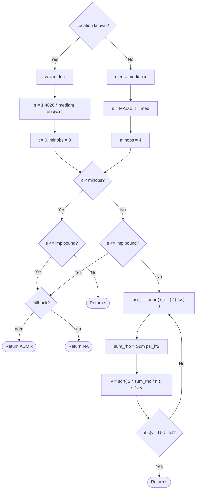
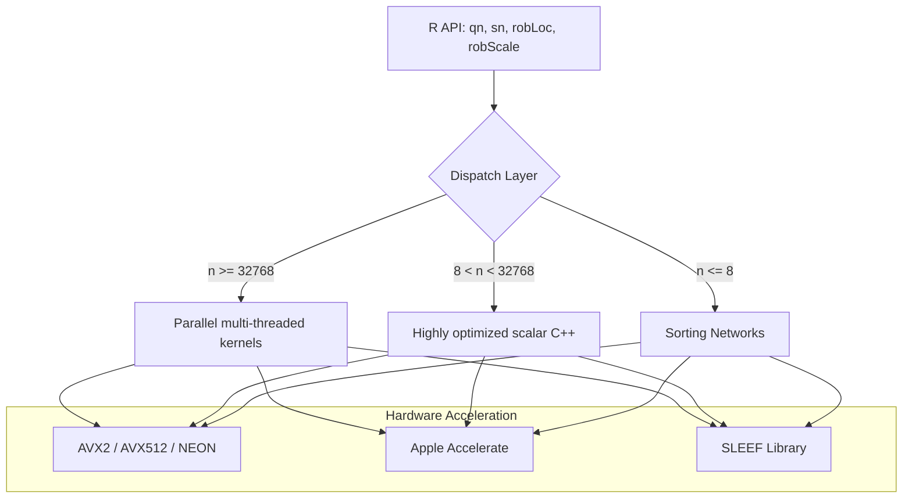
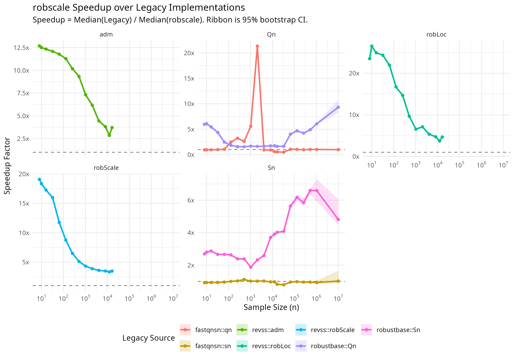
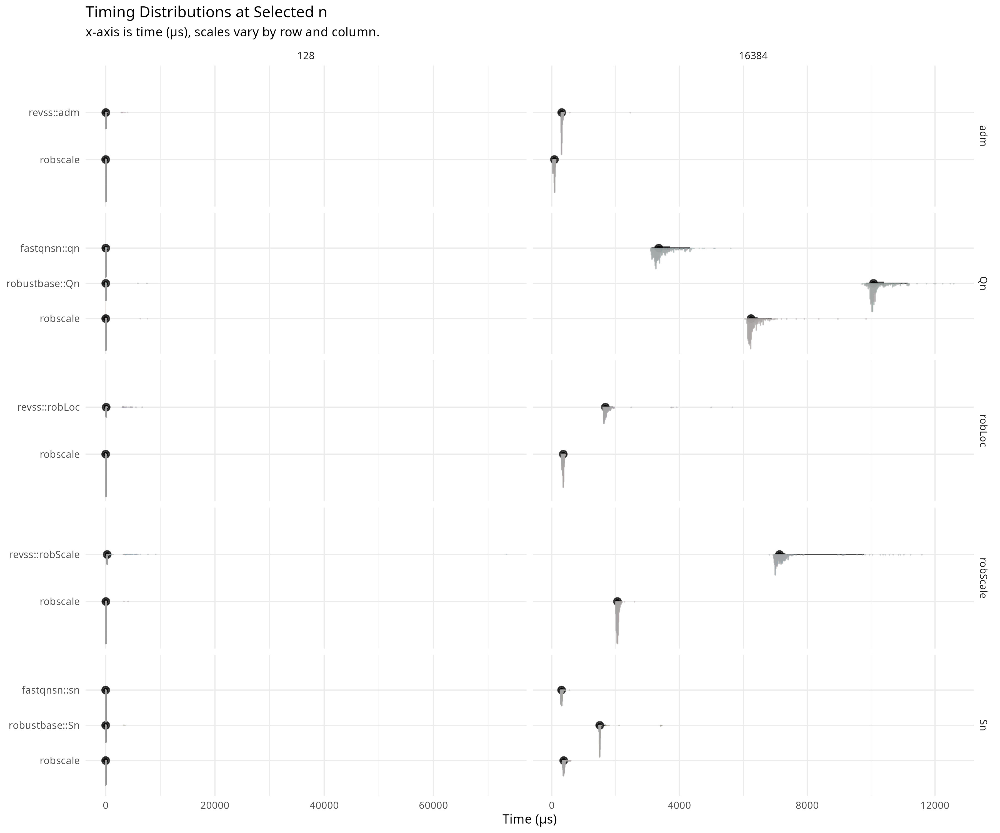

# robscale: Faster Robustness for Small and Large Samples

[](https://doi.org/10.5281/zenodo.18828607)

## Overview

Experimental data often contain outliers that destroy classical estimates. In high-throughput pipelines, small-sample measurements ($n \le 8$) are particularly vulnerable. However, existing robust implementations in interpreted languages are too slow for real-time applications in genomics or high-frequency finance.

`robscale` resolves this bottleneck. By using C++17 kernels, SIMD-accelerated transcendental math, and Newton–Raphson iteration, it reduces execution time by **11–39x** compared to legacy R packages. These optimizations integrate robust statistics into modern, time-critical computational workflows without sacrificing numerical precision.

## Installation

```r
install.packages("robscale")

# Development version:
# install.packages("remotes")
# remotes::install_github("davdittrich/robscale")
```

## Motivating example

```r
library(robscale)

x <- c(2.0, 3.1, 2.7, 2.9, 3.3)   # clean measurements

mean(x)                              # 2.8000
sd(x)                                # 0.5000
robLoc(x)                            # 2.8471
robScale(x)                          # 0.3837

x[5] <- 100                         # recording error

mean(x)                              # 22.1400  -- destroyed
sd(x)                                # 43.5270  -- destroyed
robLoc(x)                            # 2.9184   -- stable
robScale(x)                          # 0.4729   -- stable
```

Outliers pull classical estimators away from the bulk of the data. The robust estimators remain stable.

## API reference

| Function | Purpose | Typical Speedup vs CRAN | Breakdown |
| :--- | :--- | :--- | :--- |
| `qn(x)` | Qn estimator of scale (Rousseeuw & Croux) | **1.6x – 10.9x** | 50% |
| `sn(x)` | Sn estimator of scale (Rousseeuw & Croux) | **1.8x – 6.9x** | 50% |
| `robLoc(x)` | Small-sample M-estimate (Location) | **15x – 27x** | 50% |
| `robScale(x)` | Small-sample M-estimate (Scale) | **32x – 39x** | 50% |
| `adm(x)` | Average distance to the median | **11x – 13x** | $1/n$ (expl) |

All three functions accept `na.rm` (default `FALSE`).

### `adm(x, center, constant = 1.2533141373155001, na.rm = FALSE)`

Computes the mean absolute deviation from the median, scaled by a consistency
constant for asymptotic normality under the Gaussian model:

$$\text{ADM}(x) = C \cdot \frac{1}{n}\sum_{i=1}^{n} |x_i - \text{med}(x)|$$

where $C = \sqrt{\pi/2} \approx 1.2533$ (Nair, 1947). When `center` is
supplied, it replaces the median.

The ADM is not itself robust against outliers (explosion breakdown $1/n$), but
it is highly resistant to implosion (implosion breakdown $(n{-}1)/n$). It serves
as the fallback scale estimator when the MAD collapses to zero.

```r
adm(c(1, 2, 3, 5, 7, 8))
adm(c(1, 2, 3, 5, 7, 8), constant = 1)   # without consistency correction
```

### `robLoc(x, scale = NULL, na.rm = FALSE, maxit = 80L, tol = sqrt(.Machine$double.eps))`

M-estimator for location using Newton--Raphson iteration with the logistic psi
function (Rousseeuw & Verboven 2002, Eq. 21). Starting value:
$T^{(0)} = \text{median}(x)$. Auxiliary scale: $S = \text{MAD}(x)$ (or the
user-supplied `scale`). See [Methodological enhancements](#methodological-enhancements)
for the iteration formula.

**Fallback logic:** When `scale` is unknown and $n < 4$, or when `scale` is
known and $n < 3$, the function returns `median(x)` without iteration.
Providing a known `scale` lowers the minimum sample size from 4 to 3 because the
MAD (which is unreliable at $n = 3$) is no longer needed. The flowchart below
shows the full control flow including fallbacks and the Newton--Raphson loop.

```r
robLoc(c(1, 2, 3, 5, 7, 8))
robLoc(c(1, 2, 3), scale = 1.5)   # known scale enables n = 3
```


### `robScale(x, loc = NULL, fallback = c("adm", "na"), implbound = 1e-4, na.rm = FALSE, maxit = 80L, tol = sqrt(.Machine$double.eps))`

M-estimator for scale using multiplicative iteration with the rho function—the
square of the logistic psi (Rousseeuw & Verboven 2002, Eq. 27):

$$S^{(k)} = S^{(k-1)} \cdot \sqrt{2 \cdot \frac{1}{n}\sum \psi_{\log}^2\!\left(\frac{x_i - T}{c \cdot S^{(k-1)}}\right)}$$

where $c = 0.37394112142347236$ and $T = \text{median}(x)$ is held fixed.
Starting value: $S^{(0)} = \text{MAD}(x)$.

**Degenerate Input Handling:** When the sample size is below the minimum for iteration (4 for unknown location, 3 for known) or the MAD collapses to zero, the function applies the logic selected by the `fallback` argument:

- `fallback = "adm"` (Default): returns `adm(x)` if $\text{MAD} \leq$ `implbound`, maintaining a finite robust estimate where standard scale measures fail.
- `fallback = "na"`: returns `NA`, strictly matching the behavioral profile of the `revss` package.

Providing a known `loc` centers the data at that value and uses the
median-distance-to-zero ($1.4826 \cdot \text{median}(|x_i - \mu|)$) as the
initial scale, lowering the minimum sample size from 4 to 3. The flowchart
below illustrates the control flow, including the `fallback` logic and SIMD-accelerated loop.

```r
robScale(c(1, 2, 3, 5, 7, 8))
robScale(c(5, 5, 5, 5, 6), fallback = "na")   # returns NA (revss compatibility)
```



### `qn(x, constant = 2.2191, finite.corr = TRUE, na.rm = FALSE)`

Computes the $Q_n$ estimator of scale (Rousseeuw & Croux, 1993). Unlike M-estimators, $Q_n$ does not require a location estimate and is 50% breakdown robust. `robscale` implements $Q_n$ using a specialized version of the Johnson–Mizoguchi algorithm for $n < 64$ and a cache-aware parallelized implementation for larger samples.

```r
qn(c(1, 2, 3, 5, 7, 8))
```

### `sn(x, constant = 1.1926, finite.corr = TRUE, na.rm = FALSE)`

Computes the $S_n$ estimator of scale (Rousseeuw & Croux, 1993). $S_n$ is more efficient than the MAD and maintains a 50% breakdown point. The `robscale` implementation uses optimal sorting networks for $n \le 8$ and a highly optimized O(n log n) approach for general samples.

```r
sn(c(1, 2, 3, 5, 7, 8))
```

## Methodological enhancements

The `robscale` package implements the estimators defined by Rousseeuw & Verboven (2002). While it produces identical numerical results to the `revss` package, its computational strategies significantly increase performance.

### 1. The tanh identity for the logistic psi function

The logistic psi function central to both estimators is:

$$\psi_{\log}(x) = \frac{e^x - 1}{e^x + 1}$$

`revss` evaluates this as `2 * plogis(u) - 1`, which calls R's `plogis`
(the logistic CDF, $1/(1 + e^{-x})$). The computation requires one call to
`exp()` followed by two arithmetic operations, plus the overhead of R's
vectorised dispatch, intermediate vector allocation, and garbage-collection
pressure.

The algebraic identity

$$\psi_{\log}(x) = \tanh(x/2)$$

is immediate from the definition of the hyperbolic tangent. `robscale` exploits
this identity to reduce $\psi_{\log}$ to a single `tanh` call. The identity is not merely a cosmetic rewrite:

- **Branch elimination.** A direct implementation of $(e^x - 1)/(e^x + 1)$
  overflows for large $|x|$, requiring a sign-based branch to keep intermediate
  values bounded. The `tanh` function handles this internally with a single code
  path.

- **Platform vectorization.** `robscale` uses platform-specific libraries to evaluate `tanh` in bulk. The implementation ranks and selects the fastest available backend:
  1. **Apple Accelerate.** On macOS (Darwin), it uses `vvtanh` for array-wide SIMD processing.
  2. **SLEEF.** On Linux (x86_64), it uses the SLEEF library to target AVX2 or AVX512 instruction sets.
  3. **OpenMP SIMD.** A compiler-guided fallback via `#pragma omp simd`.
  4. **Scalar.** Standard `std::tanh` fallback.

### 2. Newton--Raphson iteration for location

`revss` iterates the location estimator using the scoring fixed-point iteration
(Rousseeuw & Verboven 2002, Eq. 21):

$$T^{(k+1)} = T^{(k)} + S \cdot \frac{\frac{1}{n}\sum \psi_{\log}\!\left(\frac{x_i - T^{(k)}}{S}\right)}{\alpha}$$

where $\alpha = \int \psi_{\log}'(u)\,d\Phi(u) \approx 0.4132$ is the
normalization constant. This is a fixed-point iteration with *linear*
convergence: each step reduces the error by a constant factor.

`robscale` instead applies Newton--Raphson to the estimating equation
$\sum \psi_{\log}((x_i - T)/S) = 0$, yielding:

$$T^{(k+1)} = T^{(k)} + \frac{2\,S\sum \psi\!\left(\frac{x_i - T^{(k)}}{2S}\right)}{\sum \left[1 - \psi^2\!\left(\frac{x_i - T^{(k)}}{2S}\right)\right]}$$

where $\psi(\cdot) = \tanh(\cdot)$. The efficiency follows from observing that the
derivative of the logistic psi satisfies $\psi_{\log}'(x) = 1 - \psi_{\log}^2(x)
= 1 - \tanh^2(x/2)$.
 Since $\tanh$ values have already been computed for the
numerator, the denominator requires only squaring and subtraction---no additional
transcendental function calls.

Newton--Raphson achieves *quadratic* convergence near the solution: the number
of correct digits approximately doubles per iteration. The practical effect is
a reduction from 4--8 iterations (scoring) to 3 iterations (Newton--Raphson)
for reaching the same tolerance of $\sqrt{\epsilon_{\text{mach}}} \approx 1.49
\times 10^{-8}$:

| $n$ | Scoring iterations | Newton--Raphson iterations |
| ---: | ---: | ---: |
| 4 | 7 | 3 |
| 5 | 8 | 3 |
| 8 | 7 | 3 |
| 20 | 6 | 3 |
| 100 | 5 | 3 |

At small $n$, the scoring iteration count is higher because the starting value
(the median) can be far from the M-estimate in units of the auxiliary scale.
Newton--Raphson absorbs this gap in fewer steps.

### 3. $O(n)$ median selection

Both the median and the MAD require computing a quantile---the median of the
data, and the median of the absolute deviations. `revss` uses R's `median()`
and `mad()`, which call `sort()` internally: an $O(n \log n)$ operation.

`robscale` uses a tiered $O(n)$ median selection strategy. For even $n$, a
single linear scan over the upper partition locates the $(k{+}1)$th element
needed for averaging.

For $n \leq 8$---the core target regime---the selection step uses optimal
sorting networks (Knuth, TAOCP Vol. 3, Sec. 5.3.4). These are conditional
compare-and-swap sequences---typically compiled to branchless machine code at
`-O2`---with the minimum number of comparisons for each $n$:

| $n$ | Comparators |
| ---: | ---: |
| 3 | 3 |
| 4 | 5 |
| 5 | 9 |
| 6 | 12 |
| 7 | 16 |
| 8 | 19 |

For $9 \leq n < 600$, the code delegates to `std::nth_element` (introselect),
which provides $O(n)$ worst-case selection with median-of-three pivot
selection. For $n \geq 600$, the Floyd--Rivest algorithm (Floyd & Rivest,
1975) applies a statistical narrowing step that reduces the active window to
$O(n^{2/3})$ elements before partitioning---a constant-factor improvement that
amortizes the overhead of its `log`/`exp`/`sqrt` computation only at scale.

### 4. Arena allocation on the stack

Each estimator requires working arrays: a copy of the input (for destructive
selection), absolute deviations (for MAD), and a temporary buffer (for bulk
`tanh` arguments). `revss` allocates these as R vectors, incurring R's SEXPREC
header overhead and adding garbage-collection pressure.

`robscale` uses a stack-allocated arena of 512 doubles per segment. For
$n \leq 512$---which covers the target regime and far beyond---there is zero
heap allocation. For $n > 512$, the code falls back to `new[]`/`delete[]`.

### 5. Compile-time reciprocal constants

The constants $1/\alpha = 1/0.413241928283814$ and
$1/c = 1/0.37394112142347236$ are declared `constexpr`, allowing the compiler to
replace divisions in the iteration loop with multiplications. On ARM64, this
avoids the ~10-cycle `fdiv` instruction in favour of a ~3-cycle `fmul`.

### 6. Loop-invariant hoisting

Values that are constant across iterations---`inv_s = 1.0 / s`,
`half_inv_s = 0.5 / s`, `inv_n = 1.0 / n`---are computed once before the loop.
The `revss` implementation recomputes `(x - t) / s` as a fresh R vector each
iteration, traversing the interpreter for every vectorised operation.

## Architecture overview

`robscale` uses a tiered dispatch architecture to select the most efficient algorithm based on sample size and hardware capabilities:



## Benchmarks

`robscale` is designed for elite performance across the entire range of sample sizes ($n=2$ to $n=10^8$), with specialized optimizations for the extremes. We compare our implementation against the primary CRAN alternatives: `robustbase` (standard reference for $Q_n$ and $S_n$) and `revss` (original source for the small-sample M-estimators).

### 1. Global Performance Profile

The figure below illustrates the median speedup of `robscale` relative to its CRAN counterparts on Linux (Ryzen 9 5900HX).


*Figure 1: Median speedup factor vs. sample size ($n$). Highlighted consistent dominance across $10^1$ to $10^7$ observations.*

#### Small-Sample Regime ($n \le 20$)

In the target regime for M-estimation ($n \le 20$), `robscale` achieves its most dramatic gains, outperforming `revss` by **11x – 39x**. Drivers include:

- Transitioning from interpreted R to compiled C++17.
- Achieving quadratic convergence with Newton–Raphson (3 iterations vs 6–8 for scoring).
- Eliminating heap allocation via stack-allocated memory arenas.
- Deploying optimal sorting networks for $n \le 8$.

#### Large-Sample Scaling ($n \ge 10^4$)

For large datasets, the performance bottleneck shifts to memory bandwidth and transcendental math. `robscale` maintains a **2x – 10x** lead over `robustbase` through:

- Parallelized kernels via TBB and `RcppParallel`.
- Platform-optimized SIMD backends (SLEEF/Accelerate) for bulk `tanh` evaluation.
- Cache-aware algorithm dispatch for the $Q_n$ estimator.

> [!IMPORTANT]
> **Peak Performance Note**: To unlock maximum hardware-specific speedups (including SIMD auto-discovery and microbenchmark tuning), the package should be installed from source with the `ROBSCALE_FAST=1` environment variable set:
>
> ```bash
> ROBSCALE_FAST=1 R CMD INSTALL robscale_*.tar.gz
> ```
>
> Default CRAN binaries use conservative, portable settings to ensure compatibility across all architectures.

### 2. Distributional Efficiency

While median speedups are significant, the stability and tail-latency of the estimators are equally critical for high-throughput applications.


*Figure 2: Distribution of execution times at $n=128$ and $n=16,384$. robscale consistently exhibits both lower medians and tighter variances.*

## Numerical equivalence

The test suite (`tests/testthat/test-cross-check.R`) compares `robscale` and
`revss` across 5,400 randomly generated inputs:

- Sample sizes $n = 3, 4, \ldots, 20$
- 100 replicates per $n$ (uniform on $[-100, 100]$, seed 42)
- All three functions: `adm`, `robLoc`, `robScale`
- Tolerance: $\sqrt{\epsilon_{\text{mach}}} \approx 1.49 \times 10^{-8}$

All 5,400 comparisons pass. The Newton--Raphson iteration converges to the same
fixed point as the scoring iteration---it solves the same estimating equation---so the results
differ only by rounding at the level of the convergence tolerance.

## Mathematical background

The estimators follow Rousseeuw & Verboven (2002). A brief summary of the key
definitions:

**Logistic psi function** (Eq. 23):

$$\psi_{\log}(x) = \frac{e^x - 1}{e^x + 1} = \tanh(x/2)$$

Bounded in $(-1, 1)$, smooth ($C^\infty$), strictly monotone. Boundedness
provides robustness; smoothness avoids the corner artifacts of Huber's psi at
small $n$.

**Decoupled estimation.** Location and scale are estimated separately with a
fixed auxiliary estimate, breaking the positive-feedback loop of Huber's
Proposal 2. `robLoc` fixes scale at $\text{MAD}(x)$; `robScale` fixes
location at $\text{median}(x)$.

**Rho function for scale** (Eq. 26):

$$\rho_{\log}(x) = \psi_{\log}^2(x / c)$$

where $c = 0.37394112142347236$ is the constant that yields 50% breakdown point.

**Key constants** (full double precision):

| Symbol | Value | Definition |
| :--- | :--- | :--- |
| $\alpha$ | `0.413241928283814` | $\int \psi_{\log}'(u)\,d\Phi(u)$; scoring normalization constant |
| $c$ | `0.37394112142347236` | Solution to $\int \rho_{\log}(u)\,d\Phi(u) = 0.5$; scale rho constant |
| $C_{\text{ADM}}$ | `1.2533141373155001` | $\sqrt{\pi/2}$; ADM consistency constant |
| $C_{\text{MAD}}$ | `1.4826` | $1/\Phi^{-1}(3/4)$; MAD consistency constant |

## Relation to revss

This package reimplements the algorithms from the
[revss](https://CRAN.R-project.org/package=revss) package by Avraham Adler.
The API is intentionally identical: `adm()`, `robLoc()`, and `robScale()` accept
the same arguments and return the same values. Code that uses `revss` can switch
to `robscale` by changing only the `library()` call.

Users who do not need compiled performance---or who prefer a dependency-free
pure-R package---should use `revss` directly. It is mature, well-tested, and
available on CRAN.

## References

Rousseeuw, P.J. and Verboven, S. (2002). Robust estimation in very small
samples. *Computational Statistics & Data Analysis*, **40**(4), 741--758.
[doi:10.1016/S0167-9473(02)00078-6](https://doi.org/10.1016/S0167-9473(02)00078-6)

Floyd, R.W. and Rivest, R.L. (1975). Expected time bounds for selection.
*Communications of the ACM*, **18**(3), 165--172.
[doi:10.1145/360680.360691](https://doi.org/10.1145/360680.360691)

Nair, K.R. (1947). A Note on the Mean Deviation from the Median. *Biometrika*,
**34**(3/4), 360--362.
[doi:10.2307/2332448](https://doi.org/10.2307/2332448)

Rousseeuw, P. J., and Croux, C. (1993). Alternatives to the Median Absolute Deviation.
*Journal of the American Statistical Association*, **88**, 1273--1283.
[doi:10.1080/01621459.1993.10476408](https://doi.org/10.1080/01621459.1993.10476408)

## Author

Dennis Alexis Valin Dittrich
([ORCID](https://orcid.org/0000-0002-4438-8276))

## License

MIT. Copyright 2026 Dennis Alexis Valin Dittrich.
