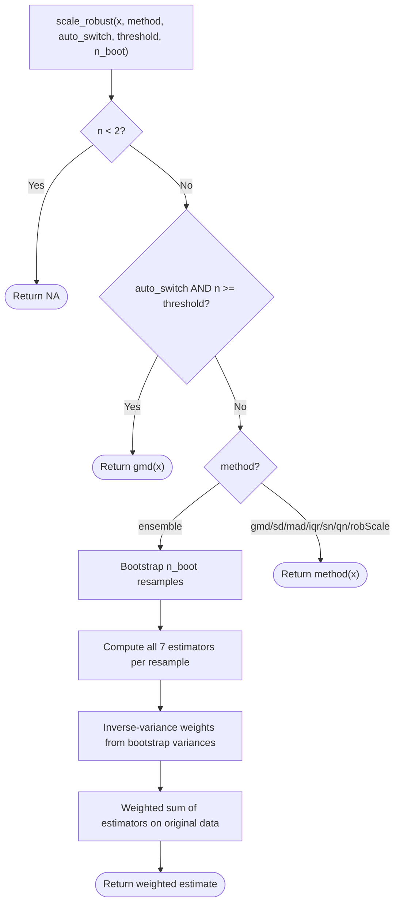
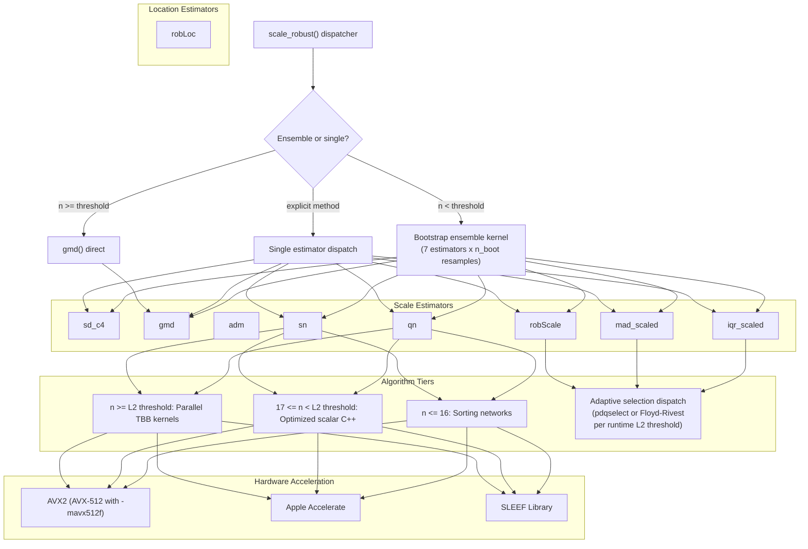
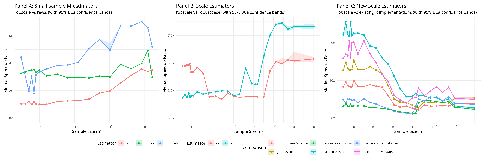
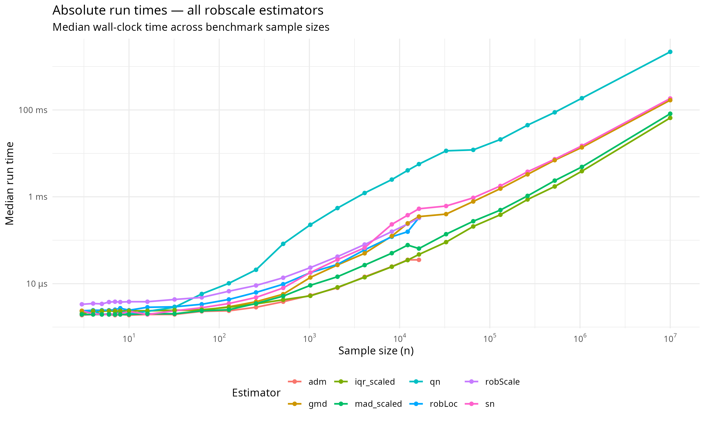

# robscale: Fast Robust Location and Scale Estimation


[](https://doi.org/10.5281/zenodo.18828607)

## Overview

`robscale` provides 11 exported functions spanning the full
robustness–efficiency spectrum: the bias-corrected standard deviation
(`sd_c4`, 100% ARE), the Gini mean difference (`gmd`, 98% ARE, 29.3%
breakdown), the average deviation from the median (`adm`, 88.3% ARE),
the Rousseeuw–Croux estimators (`qn`, 82.3% ARE, `sn`, 58.2% ARE, both
50% breakdown), the M-estimators (`robScale`, `robLoc`), and the
computationally light `iqr_scaled` and `mad_scaled`. The unified
`scale_robust()` dispatcher combines all 7 scale estimators in a
variance-weighted bootstrap ensemble for small samples ($n < 20$) and
auto-switches to the GMD for larger ones. `get_consistency_constant()`
exposes the finite-sample bias-correction factors used throughout.

Against `revss`, `robscale` achieves **3.2–3.8x** speedups for
`robScale()` and **3.0–3.5x** for `robLoc()` at small $n$, with
**1.2–5.2x** for `adm()` at $n \ge 128$. Against `robustbase`, `qn` and
`sn` run at **1.6–5.0x** and **1.8–9.1x** respectively, peaking near
**9.1x** at $n = 10^7$ as TBB parallelism engages. `gmd`, `iqr_scaled`,
and `mad_scaled` beat their base R counterparts by **2.6–13.3x**,
**2.6–25.6x**, and **4.0–19.7x** respectively.

Speed comes from C++17 kernels with platform-specific SIMD
vectorization, $O(n)$ selection algorithms, stack-allocated memory
arenas, and Intel TBB parallelism for large datasets.

## Installation

``` r
install.packages("robscale")

# Development version:
# install.packages("remotes")
# remotes::install_github("davdittrich/robscale")
```

## Motivating example

``` r
library(robscale)

x <- c(2.0, 3.1, 2.7, 2.9, 3.3)   # clean measurements

# Recommended entry point: scale_robust()
scale_robust(x)                      # ensemble (small n < 20)
scale_robust(rnorm(50))              # auto-switches to gmd (n >= 20)

# Individual estimators span the robustness-efficiency frontier
gmd(x)                               # 98% ARE, 29.3% breakdown
qn(x)                                # 82.3% ARE, 50% breakdown
mad_scaled(x)                        # 36.8% ARE, 50% breakdown

# Confidence intervals
qn(x, ci = TRUE)                     # point estimate + 95% CI
gmd(x, ci = TRUE, level = 0.99)      # 99% CI

# Outlier resistance
x[5] <- 100                          # recording error
sd(x)                                # destroyed
gmd(x)                               # stable (29.3% breakdown)
qn(x)                                # stable (50% breakdown)
mad_scaled(x)                        # stable (50% breakdown)
```

## API reference

<div id="tbl-api-scale">

Table 1

**Table 1: Scale estimators** (sorted by decreasing ARE)

| Function | Purpose | ARE | Breakdown | Complexity | Reference |
|:---|:---|:---|:---|:---|:---|
| `sd_c4(x)` | Bias-corrected standard deviation | **100%** | 0% | $O(n)$ | Welford (1962) |
| `gmd(x)` | Gini mean difference | **98%** | 29.3% | $O(n \log n)$ | Gini (1912); Nair (1936) |
| `adm(x)` | Average deviation from median | **88.3%** | $1/n$ | $O(n)$ | Nair (1947) |
| `qn(x)` | $Q_n$ scale estimator | **82.3%** | 50% | $O(n \log n)$ | Rousseeuw & Croux (1993) |
| `sn(x)` | $S_n$ scale estimator | **58.2%** | 50% | $O(n \log n)$ | Rousseeuw & Croux (1993) |
| `robScale(x)` | M-estimate of scale | **55.0%** | 50% | $O(n)$ iters | Rousseeuw & Verboven (2002) |
| `iqr_scaled(x)` | Scaled interquartile range | **37%** | 25% | $O(n)$ | Bickel & Lehmann (1976) |
| `mad_scaled(x)` | Scaled median absolute deviation | **36.8%** | 50% | $O(n)$ | Rousseeuw & Croux (1993) |

</div>

At the top of this spectrum, `sd_c4` retains full efficiency but
collapses under a single outlier. The `gmd` occupies the practical sweet
spot: 98% efficiency with 29.3% breakdown—sufficient for most
contamination levels. For adversarial settings where breakdown must be
maximized, `qn` provides the best combination of high breakdown (50%)
and high efficiency (82.3%).

<div id="tbl-api-dispatch">

Table 2

**Table 2: Dispatcher and utilities**

| Function | Purpose |
|:---|:---|
| `scale_robust(x)` | Unified dispatcher: ensemble for small $n$, auto-switches to GMD for large $n$ |
| `get_consistency_constant(method, n)` | Returns the consistency constant or finite-sample correction for a given estimator |

</div>

Additionally, `robLoc(x)` provides an M-estimate of location (98.4% ARE,
50% breakdown; Rousseeuw & Verboven 2002). All functions accept `na.rm`
(default `FALSE`). Most scale estimators accept `ci = FALSE` and
`level = 0.95`; when `ci = TRUE`, they return an object of class
`"robscale_ci"` containing the point estimate and a confidence interval
(analytical for individual estimators, bootstrap for `scale_robust()`).
The exception is `robLoc()`, which does not support confidence
intervals.

### `sd_c4(x, na.rm = FALSE, ci = FALSE, level = 0.95)`

Computes the sample standard deviation corrected by $c_4(n)$ to remove
the small-sample bias of the square-root estimator:

$$\hat\sigma = \frac{s}{c_4(n)} = \frac{s}{\sqrt{2/(n{-}1)} \cdot \Gamma(n/2) / \Gamma((n{-}1)/2)}$$

where $s$ is the usual sample standard deviation. Uses Welford’s online
algorithm for numerically stable variance computation, avoiding
catastrophic cancellation. This is a non-robust estimator (0% breakdown)
with 100% ARE by construction—it serves as the efficiency anchor in the
ensemble.

``` r
sd_c4(c(1, 2, 3, 5, 7, 8))
```

### `gmd(x, constant = 0.886226925452758, na.rm = FALSE, ci = FALSE, level = 0.95)`

Computes the Gini mean difference (Gini, 1912), scaled by a consistency
constant for asymptotic normality under the Gaussian model:

$$\text{GMD}(x) = C \cdot \frac{2}{n(n{-}1)}\sum_{i=1}^{n} (2i - n - 1)\, x_{(i)}$$

where $x_{(1)} \le \ldots \le x_{(n)}$ are the order statistics and
$C = \sqrt{\pi}/2 \approx 0.8862$. The computation requires a full sort
($(O(n \log n))$), with sorting networks applied for $n \le 16$.

The GMD achieves **98% ARE** (Nair, 1936) with a **29.3% breakdown
point**, making it the most statistically efficient robust alternative
in this package. It is the estimator `scale_robust()` auto-switches to
for large samples.

``` r
gmd(c(1, 2, 3, 5, 7, 8))
gmd(c(1, 2, 3, 5, 7, 8), constant = 1)   # raw (unscaled)
```

### `adm(x, center, constant = 1.2533141373155001, na.rm = FALSE, ci = FALSE, level = 0.95)`

Computes the mean absolute deviation from the median, scaled by a
consistency constant for asymptotic normality under the Gaussian model:

$$\text{ADM}(x) = C \cdot \frac{1}{n}\sum_{i=1}^{n} |x_i - \text{med}(x)|$$

where $C = \sqrt{\pi/2} \approx 1.2533$ (Nair, 1947). When `center` is
supplied, it replaces the median. The ADM achieves **88.3% ARE** but
breaks down at a single outlier ($1/n$ breakdown point). It serves as
the fallback scale estimator when the MAD collapses to zero.

``` r
adm(c(1, 2, 3, 5, 7, 8))
adm(c(1, 2, 3, 5, 7, 8), constant = 1)   # without consistency correction
adm(c(1, 2, 3, 5, 7, 8), ci = TRUE)      # with 95% CI
```

### `robLoc(x, scale = NULL, na.rm = FALSE, maxit = 80L, tol = sqrt(.Machine$double.eps))`

M-estimator for location defined by the logistic psi function (Rousseeuw
& Verboven 2002, Eq. 21), solved via Newton–Raphson iteration. Starting
value: $T^{(0)} = \text{median}(x)$. Auxiliary scale:
$S = \text{MAD}(x)$ (or the user-supplied `scale`).

**Fallback logic:** When `scale` is unknown and $n < 4$, or when `scale`
is known and $n < 3$, the function returns `median(x)` without
iteration. Providing a known `scale` lowers the minimum sample size from
4 to 3 because the MAD (which is unreliable at $n = 3$) is no longer
needed.

``` r
robLoc(c(1, 2, 3, 5, 7, 8))
robLoc(c(1, 2, 3), scale = 1.5)   # known scale enables n = 3
```

### `robScale(x, loc = NULL, fallback = c("adm", "na"), implbound = 1e-4, na.rm = FALSE, maxit = 80L, tol = sqrt(.Machine$double.eps), ci = FALSE, level = 0.95)`

M-estimator for scale using multiplicative iteration with the rho
function—the square of the logistic psi (Rousseeuw & Verboven 2002, Eq.
27):

$$S^{(k)} = S^{(k-1)} \cdot \sqrt{2 \cdot \frac{1}{n}\sum \psi_{\log}^2\!\left(\frac{x_i - T}{c \cdot S^{(k-1)}}\right)}$$

where $c = 0.37394112142347236$ and $T = \text{median}(x)$ is held
fixed. Starting value: $S^{(0)} = \text{MAD}(x)$.

**Degenerate input handling:** When the sample size falls below the
minimum for iteration (4 for unknown location, 3 for known), the
function returns the initial MAD-based scale directly if it is nonzero.
When the MAD collapses to zero (i.e. MAD $\leq$ `implbound`), the
`fallback` argument controls the result:

- `fallback = "adm"` (Default): returns `adm(x)`, maintaining a finite
  robust estimate where standard scale measures fail.
- `fallback = "na"`: returns `NA`, strictly matching the behavioral
  profile of the `revss` package.

Providing a known `loc` centers the data at that value and uses the
median-distance-to-zero ($(1.4826 \cdot \text{median}(|x_i - \mu|))$) as
the initial scale, lowering the minimum sample size from 4 to 3.

``` r
robScale(c(1, 2, 3, 5, 7, 8))
robScale(c(5, 5, 5, 5, 6), fallback = "na")   # returns NA (revss compatibility)
```

### `qn(x, constant = 2.2191, finite.corr = TRUE, na.rm = FALSE, ci = FALSE, level = 0.95)`

Computes the $Q_n$ estimator of scale (Rousseeuw & Croux, 1993). Unlike
M-estimators, $Q_n$ requires no location estimate and achieves a 50%
breakdown point. `robscale` implements $Q_n$ with a tiered strategy: a
brute-force exact algorithm for small $n$ (below `qn_exact_threshold`)
and a cache-aware parallelized Johnson-style algorithm for larger
samples.

``` r
qn(c(1, 2, 3, 5, 7, 8))
qn(c(1, 2, 3, 5, 7, 8), ci = TRUE)   # with 95% CI
```

### `sn(x, constant = 1.1926, finite.corr = TRUE, na.rm = FALSE, ci = FALSE, level = 0.95)`

Computes the $S_n$ estimator of scale (Rousseeuw & Croux, 1993). $S_n$
is more statistically efficient than the MAD and maintains a 50%
breakdown point. `robscale` uses optimal sorting networks for $n \le 16$
and a highly optimized parallelized inner-median algorithm for general
samples.

``` r
sn(c(1, 2, 3, 5, 7, 8))
sn(c(1, 2, 3, 5, 7, 8), ci = TRUE)   # with 95% CI
```

### `iqr_scaled(x, constant = 0.741301109252801, na.rm = FALSE, ci = FALSE, level = 0.95)`

Computes the interquartile range scaled by a consistency constant for
asymptotic normality under the Gaussian model:

$$\text{IQR}_s(x) = C \cdot (Q_{0.75} - Q_{0.25})$$

where $Q_p$ denotes the Type 7 quantile (R default) and
$C = 1/(\Phi^{-1}(0.75) - \Phi^{-1}(0.25)) \approx 0.7413$ (Bickel &
Lehmann, 1976). Unlike `stats::IQR()`, which requires a full
$O(n \log n)$ sort, this implementation uses dual $O(n)$ pdqselect
calls—one per quartile—and exploits the $Q_1$ partition to narrow the
$Q_3$ search, providing a substantial speedup for large datasets. The
IQR achieves **37% ARE** with a **25% breakdown point**.

``` r
iqr_scaled(c(1, 2, 3, 5, 7, 8))
iqr_scaled(c(1, 2, 3, 5, 7, 8), constant = 1)   # raw IQR
```

### `mad_scaled(x, center, constant = 1.482602218505602, na.rm = FALSE, ci = FALSE, level = 0.95)`

Computes the median absolute deviation from the median, scaled by a
consistency constant for asymptotic normality:

$$\text{MAD}_s(x) = C \cdot \text{med}_i\, |x_i - \text{med}(x)|$$

where $C = 1/\Phi^{-1}(3/4) \approx 1.4826$. Unlike `stats::mad()`, this
implementation uses adaptive $O(n)$ selection (Floyd–Rivest below a
cache-derived threshold, pdqselect above) with sorting networks for
$n \le 16$, avoiding a full sort. The MAD achieves **36.8% ARE**
(Rousseeuw & Croux, 1993: “about 37%”) with a **50% breakdown point**.

``` r
mad_scaled(c(1, 2, 3, 5, 7, 8))
mad_scaled(c(1, 2, 3, 5, 7, 8), constant = 1)   # raw MAD
```

### `scale_robust(x, method = c("ensemble", "gmd", "sd", "mad", "iqr", "sn", "qn", "robScale"), auto_switch = TRUE, threshold = 20L, n_boot = 200L, na.rm = FALSE, ci = FALSE, level = 0.95, boot_method = c("auto", "bca", "percentile", "parametric"))`

Unified dispatcher for robust scale estimation. Operates in three modes:

1.  **Ensemble** (default, `method = "ensemble"`): variance-weighted
    combination of all 7 scale estimators via bootstrap resampling.
2.  **Auto-switch** (`auto_switch = TRUE`, default): when $n \ge$
    `threshold` (default 20), returns `gmd(x)` directly—the most
    efficient robust estimator at negligible cost.
3.  **Explicit method**: dispatches to a specific estimator by name.

When `ci = TRUE`, the ensemble and auto-switch modes use bootstrap
confidence intervals (BCa by default); explicit single-method dispatch
uses analytical intervals based on each estimator’s asymptotic relative
efficiency.

``` r
scale_robust(c(1, 2, 3, 5, 7, 8))           # ensemble (n < 20)
scale_robust(rnorm(50))                       # auto-switches to gmd
scale_robust(rnorm(50), auto_switch = FALSE)  # forces ensemble
scale_robust(rnorm(50), method = "qn")        # explicit Qn
scale_robust(c(1, 2, 3, 5, 7, 8), ci = TRUE) # ensemble + bootstrap CI
```



The ensemble combines: `sd_c4`, `gmd`, `mad_scaled`, `iqr_scaled`, `sn`,
`qn`, and `robScale`. Bootstrap resampling uses a deterministic
XorShift32 PRNG seeded by replicate index, ensuring reproducible results
without requiring `set.seed()`.

Note: the method name `"sd"` maps to `sd_c4`.

### `get_consistency_constant(method, n = NULL)`

Returns the consistency constant (or finite-sample correction factor)
used to make a given estimator consistent for the population standard
deviation under normality. Supported `method` values: `"c4"`, `"gmd"`,
`"mad"`, `"iqr"`, `"sn"`, `"qn"`.

When `n = NULL`, the function returns the asymptotic consistency
constant. When `n` is supplied, it returns the finite-sample correction
factor for that sample size—useful for small-sample bias (for $n$)
correction.

``` r
get_consistency_constant("mad")          # asymptotic: 1/qnorm(3/4)
get_consistency_constant("qn", n = 10)  # finite-sample correction at n = 10
```

## Performance architecture

`robscale` achieves its speed gains through five cooperating mechanisms.

**SIMD vectorization.** The logistic psi function reduces to
$\tanh(x/2)$, dispatched to the fastest available platform backend:
Apple Accelerate (`vvtanh`) on macOS, SLEEF on Linux x86_64, and
`#pragma omp simd` as a portable fallback. For `robLoc()`, a fused AVX2
kernel accumulates $\psi_i$ and $\text{d}\psi_i$ in a single pass over
the data, halving memory reads relative to the standard three-pass
approach.

**$O(n)$ median selection.** Median and MAD computation uses optimal
sorting networks for $n \le 16$ (branchless compare-and-swap sequences,
compiled to conditional-move instructions at `-O2`), introselect for
moderate $n$, and Floyd–Rivest at scale. Each estimator chooses between
Floyd–Rivest and pdqselect based on a runtime crossover threshold
derived from the per-core L2 cache size, minimizing cache pressure for
the specific working-set size of that estimator.

**Stack-allocated memory arenas.** A 64-double micro-buffer covers the
small-sample regime; a 2,048-double buffer handles moderate $n$—both
stack-allocated, with no heap traffic. `mad_scaled()` and `robScale()`
use fused single-buffer algorithms that compute median and absolute
deviations in-place on the same array, halving memory consumption and
reducing cache pressure in the ensemble where multiple estimators share
working memory.

**Newton–Raphson convergence.** The M-estimators replace the scoring
fixed-point iteration (linear convergence, 6–8 iterations) with
Newton–Raphson (quadratic convergence, ~3 iterations). Because $\tanh$
values are already available from the numerator, the denominator
$\sum(1 - \psi_i^2)$ requires only squaring and subtraction—no
additional transcendental calls. Loop-invariant quantities (`inv_s`,
`half_inv_s`, `inv_n`) are hoisted before the iteration; reciprocal
constants are `constexpr`, replacing divisions with multiplications.

**TBB parallelism.** The $Q_n$ and $S_n$ algorithms partition their
inner loops across Intel TBB threads for $n$ above a runtime L2-derived
threshold, scaling to all available cores. For the ensemble,
`cpp_scale_ensemble` evaluates all $7 \times
n_{\text{boot}}$ estimator calls in C++ without R overhead, sharing two
pre-allocated work buffers per bootstrap replicate.

**Compile-time.** Sorting-network entry points are instantiated once in
`src/sort_net_inst.cpp` and suppressed elsewhere via `extern template`,
reducing a cold 12-core build from approximately 300 s to 52 s. `sd_c4`
uses Welford’s one-pass algorithm for numerically stable variance
computation.

## Architecture overview

`robscale` uses a tiered dispatch architecture to select the optimal
algorithm based on sample size and available hardware. The diagram below
shows how `scale_robust()` routes through the estimator hierarchy and
how each estimator selects its algorithm tier at runtime.



## Benchmarks

Figures 1 and 2 show speedup factors relative to reference
implementations (Figure 1) and absolute wall-clock run times (Figure 2)
across sample sizes on a AMD Ryzen 9 5900HX with Radeon Graphics (Arch
Linux, R version 4.5.3 (2026-03-11), build flags:
`-march=native -mtune=native -O2 -fno-math-errno -pipe -fPIC -fopenmp-simd -DROBSCALE_HAS_OMP_SIMD -I/usr/include -DROBSCALE_HAS_SLEEF -DROBSCALE_HAS_SYSTEM_TBB -DROBSCALE_HAS_GLIBC_MVEC`,
`tanh` backend: glibc libmvec (\_ZGVdN4v_tanh), TBB: system oneTBB
(.so), benchmarked 2026-03-25). Baseline packages: `robustbase` 0.99.7,
`revss` 3.1.0, `Hmisc` 5.2.5, `GiniDistance` 0.1.1, `collapse` 2.1.6.

<div id="fig-benchmarks">



Figure 1: Median speedup factor (x) vs. sample size $n$. Panel A
compares `robLoc`, `robScale`, and `adm` against `revss`; Panel B
compares `qn` and `sn` against `robustbase`; Panel C compares `gmd`,
`iqr_scaled`, and `mad_scaled` against existing R implementations. The
thin grey line at $y = 1$ marks parity with the reference.

</div>

<div id="fig-absolute-timings">



Figure 2: Median absolute run time for each robscale estimator across
sample sizes (log–log scale). All estimators are measured on the same
machine under identical conditions; the spread of lines reflects
algorithmic complexity ($O(n)$, $O(n \log n)$, $O(n^2)$) and the onset
of TBB parallelism at large $n$.

</div>

### M-estimators (`adm`, `robLoc`, `robScale`)

`robScale()` and `robLoc()` reach **3.2–3.8x** and **3.0–3.5x** over
`revss` in the small-sample regime ($n \le 20$). Newton–Raphson
quadratic convergence (~3 iterations vs. 6–8), the fused single-pass
AVX2 kernel, stack-allocated arenas, and optimal sorting networks for
$n \le 16$ drive these gains. `adm()` matches `revss` at small $n$ (both
~1.5–2.0 µs, dominated by the R→C++ `.Call()` boundary) and leads by
**1.2–5.2x** at $n \ge 128$ as computation overtakes boundary cost. At
$n = 16{,}384$, all three NR estimators retain **3.2–5.2x** gains
because `revss` interpreter overhead scales with iteration count, not
just vector length.

### Rousseeuw–Croux estimators (`qn`, `sn`)

<div id="tbl-qn-bench">

Table 3

|      $n$ | `robustbase::Qn` | `robscale::qn` | Speedup  |
|---------:|:-----------------|:---------------|:---------|
|        8 | 9.5 µs           | 2.4 µs         | **4.0x** |
|       16 | 10.5 µs          | 2.3 µs         | **4.5x** |
|       64 | 14.4 µs          | 5.8 µs         | **2.5x** |
|     1024 | 446.4 µs         | 227.1 µs       | **2.0x** |
|    65536 | 45645.3 µs       | 12041.5 µs     | **3.9x** |
| 10000000 | 10.2 s           | 2.2 s          | **4.7x** |

</div>

<div id="tbl-sn-bench">

Table 4

|      $n$ | `robustbase::Sn` | `robscale::sn` | Speedup  |
|---------:|:-----------------|:---------------|:---------|
|        8 | 4.3 µs           | 2.0 µs         | **2.1x** |
|       16 | 4.7 µs           | 2.0 µs         | **2.4x** |
|       64 | 6.1 µs           | 2.8 µs         | **2.2x** |
|     1024 | 35.4 µs          | 18.1 µs        | **2.0x** |
|    65536 | 6890.2 µs        | 947.3 µs       | **7.3x** |
| 10000000 | 1.5 s            | 0.2 s          | **8.1x** |

</div>

For small to medium $n$, `robscale` leads by **1.6–5.0x** for `qn` and
**1.8–9.1x** for `sn`, primarily from eliminating R dispatch overhead
and using stack memory. At $n = 10^7$, `qn` runs in 2.2 s vs. 10.2 s
(**4.7x**) and `sn` in 0.2 s vs. 1.5 s (**8.1x**), as TBB parallelism
scales across cores.

### Single-pass estimators (`gmd`, `iqr_scaled`, `mad_scaled`)

<div id="tbl-new-bench">

Table 5

|      $n$ | Comparison             | Speedup   |
|---------:|:-----------------------|:----------|
|       64 | gmd vs GiniDistance    | **8.8x**  |
|       64 | gmd vs Hmisc           | **13.3x** |
|       64 | iqr_scaled vs collapse | **3.0x**  |
|       64 | iqr_scaled vs stats    | **20.6x** |
|       64 | mad_scaled vs collapse | **4.1x**  |
|       64 | mad_scaled vs stats    | **16.7x** |
|     1024 | gmd vs GiniDistance    | **3.3x**  |
|     1024 | gmd vs Hmisc           | **4.8x**  |
|     1024 | iqr_scaled vs collapse | **2.0x**  |
|     1024 | iqr_scaled vs stats    | **11.0x** |
|     1024 | mad_scaled vs collapse | **1.7x**  |
|     1024 | mad_scaled vs stats    | **5.8x**  |
|    65536 | gmd vs GiniDistance    | **3.0x**  |
|    65536 | gmd vs Hmisc           | **3.8x**  |
|    65536 | iqr_scaled vs collapse | **4.1x**  |
|    65536 | iqr_scaled vs stats    | **5.4x**  |
|    65536 | mad_scaled vs collapse | **5.4x**  |
|    65536 | mad_scaled vs stats    | **7.4x**  |
| 10000000 | gmd vs GiniDistance    | **3.7x**  |
| 10000000 | gmd vs Hmisc           | **5.0x**  |
| 10000000 | iqr_scaled vs collapse | **2.3x**  |
| 10000000 | iqr_scaled vs stats    | **2.6x**  |
| 10000000 | mad_scaled vs collapse | **3.4x**  |
| 10000000 | mad_scaled vs stats    | **4.5x**  |

</div>

`gmd` beats `Hmisc::GiniMd` by **2.6–13.3x** (C++ vs. pure R) and
`GiniDistance::gmd` by **2.2–8.8x** (both compiled, with `robscale`’s
edge from sorting networks). `iqr_scaled` leads `stats::IQR` by
**2.6–25.6x** (dual $O(n)$ pdqselect vs. full sort) and
`collapse::fquantile` by **1.3–4.7x**. `mad_scaled` leads `stats::mad`
by **4.0–19.7x** and a `collapse::fmedian`-based MAD by **1.0–6.0x**
(adaptive $O(n)$ selection vs. sorting).

> \[!NOTE\] **Source builds recommended.** Installing from source
> (`install.packages("robscale", type = "source")`) enables the
> `configure` script to detect SIMD capabilities (AVX2/FMA on x86_64,
> NEON on ARM64) and link platform-specific libraries (Apple Accelerate,
> SLEEF). Pre-built CRAN binaries use portable settings and may not
> include these optimizations. Parallelism thresholds are derived from
> the detected per-core L2 cache size at runtime on all platforms. For
> maximum performance, add the following to `~/.R/Makevars` before
> installing:
>
>     CXXFLAGS = -O3 -march=native -mtune=native

## Numerical equivalence

The test suite verifies `robscale` against reference implementations:

**Legacy M-estimators** (`tests/testthat/test-cross-check.R`): Comparing
`robscale` against the original `revss` algorithm (up to v2.0.0) across
5,400 randomly generated inputs ($n = 3, 4, \ldots, 20$; 100 replicates
per $n$; all three functions `adm`, `robLoc`, `robScale`) yields a 100%
pass rate at tolerance
$\sqrt{\epsilon_{\text{mach}}} \approx 1.49 \times 10^{-8}$. While
`robscale` maintains this numerical consistency with the established
reference, `revss` v3.1.0 has since updated its bias correction factors;
`robscale` continues to follow the original Rousseeuw & Verboven (2002)
definitions.

**Other estimators:**

- `gmd`: exact match with the R formula
  $C \cdot 2/(n(n-1)) \sum (2i - n - 1) x_{(i)}$ (`test-gmd.R`)
- `iqr_scaled`: matches `IQR(x) * 0.741301109252801` (`test-iqr.R`)
- `mad_scaled`: matches `stats::mad(x)` (`test-mad-scaled.R`)
- `sd_c4`: matches `sd(x) / c4(n)` (`test-sd-c4.R`)
- `scale_robust` ensemble: deterministic via fixed XorShift32 seeds
  (`test-ensemble.R`, `test-scale-robust.R`)

The Newton–Raphson iteration converges to the same fixed point as the
scoring iteration—it solves the same estimating equation—so results
differ only by rounding at the level of the convergence tolerance.

## Mathematical background

Full mathematical derivations, key constants, and algorithmic proofs are
in `vignette("robscale-intro")`.

## Relation to revss and robustbase

This package re-implements the M-estimators from the ‘revss’ package
(Adler, 2020) and the $Q_n$ and $S_n$ estimators from ‘robustbase’
(Maechler et al., 2026).

The API for the M-estimators is intentionally identical to `revss`:
`adm()`, `robLoc()`, and `robScale()` accept the same arguments and
return the same values. Code that uses `revss` can switch to `robscale`
by changing only the `library()` call.

For `qn()` and `sn()`, the function signatures match `robustbase::Qn()`
and `robustbase::Sn()` (with lowercase names for consistency).

Benchmark comparisons apply Fisher-consistency scaling where needed:
`gmd()` is compared against `Hmisc::GiniMd(x) * 0.8862` and
`GiniDistance::gmd(x) * 0.8862`; `iqr_scaled()` against
`stats::IQR(x) * 0.7413` and scaled `collapse::fquantile()` arrays; and
`mad_scaled()` directly against `stats::mad()` and a
`collapse::fmedian()` equivalent, since `stats::mad()` already applies
the 1.4826 factor.

Users who do not need compiled performance—or who prefer a
dependency-free pure-R package—should use `revss` or `robustbase`
directly. Both are mature, well-tested, and widely available.

## References

Adler, A. (2020). *revss: Robust Estimation in Very Small Samples*. R
package version 2.0.0.
[doi:10.32614/CRAN.package.revss](https://doi.org/10.32614/CRAN.package.revss)

Bickel, P.J. and Lehmann, E.L. (1976). Descriptive Statistics for
Nonparametric Models III. Dispersion. *Annals of Statistics*, **4**(6),
1139–1158.
[doi:10.1214/aos/1176343648](https://doi.org/10.1214/aos/1176343648)

Floyd, R.W. and Rivest, R.L. (1975). Expected time bounds for selection.
*Communications of the ACM*, **18**(3), 165–172.
[doi:10.1145/360680.360691](https://doi.org/10.1145/360680.360691)

Gini, C. (1912). *Variabilita e mutabilita*. Bologna: Tipografia di
Paolo Cuppini.

Harrell Jr., F.E. (2026). *Hmisc: Harrell Miscellaneous*. R package
version 5.2-5.
[doi:10.32614/CRAN.package.Hmisc](https://doi.org/10.32614/CRAN.package.Hmisc)

Krantz, S. (2025). *collapse: Advanced and Fast Data Transformation in
R*. R package version 2.1.6.
[doi:10.5281/zenodo.8433090](https://doi.org/10.5281/zenodo.8433090)

Maechler, M., Rousseeuw, P., Croux, C., Todorov, V., Ruckstuhl, A.,
Salibian-Barrera, M., Verbeke, T., Koller, M., Conceicao, E.L.T., and di
Palma, M.A. (2026). *robustbase: Basic Robust Statistics*. R package
version 0.99-7. <http://robustbase.r-forge.r-project.org/>

Marsaglia, G. (2003). Xorshift RNGs. *Journal of Statistical Software*,
**8**(14), 1–6.
[doi:10.18637/jss.v008.i14](https://doi.org/10.18637/jss.v008.i14)

Nair, K.R. (1936). On the Mean Deviation. *Biometrika*, **28**(3/4),
428–436. [doi:10.2307/2333958](https://doi.org/10.2307/2333958)

Nair, K.R. (1947). A Note on the Mean Deviation from the Median.
*Biometrika*, **34**(3/4), 360–362.
[doi:10.2307/2332448](https://doi.org/10.2307/2332448)

Nguyen, D. and Dang, X. (2022). *GiniDistance: A New Gini Correlation
Between Quantitative and Qualitative Variables*. R package version
0.1.1.
[doi:10.32614/CRAN.package.GiniDistance](https://doi.org/10.32614/CRAN.package.GiniDistance)

Rousseeuw, P.J. and Croux, C. (1993). Alternatives to the Median
Absolute Deviation. *Journal of the American Statistical Association*,
**88**, 1273–1283.
[doi:10.1080/01621459.1993.10476408](https://doi.org/10.1080/01621459.1993.10476408)

Rousseeuw, P.J. and Verboven, S. (2002). Robust estimation in very small
samples. *Computational Statistics & Data Analysis*, **40**(4), 741–758.
[doi:10.1016/S0167-9473(02)00078-6](https://doi.org/10.1016/S0167-9473(02)00078-6)

Welford, B.P. (1962). Note on a Method for Calculating Corrected Sums of
Squares and Products. *Technometrics*, **4**(3), 419–420.
[doi:10.1080/00401706.1962.10490022](https://doi.org/10.1080/00401706.1962.10490022)

## Author

Dennis Alexis Valin Dittrich
([ORCID](https://orcid.org/0000-0002-4438-8276))

## License

MIT. Copyright 2026 Dennis Alexis Valin Dittrich.
