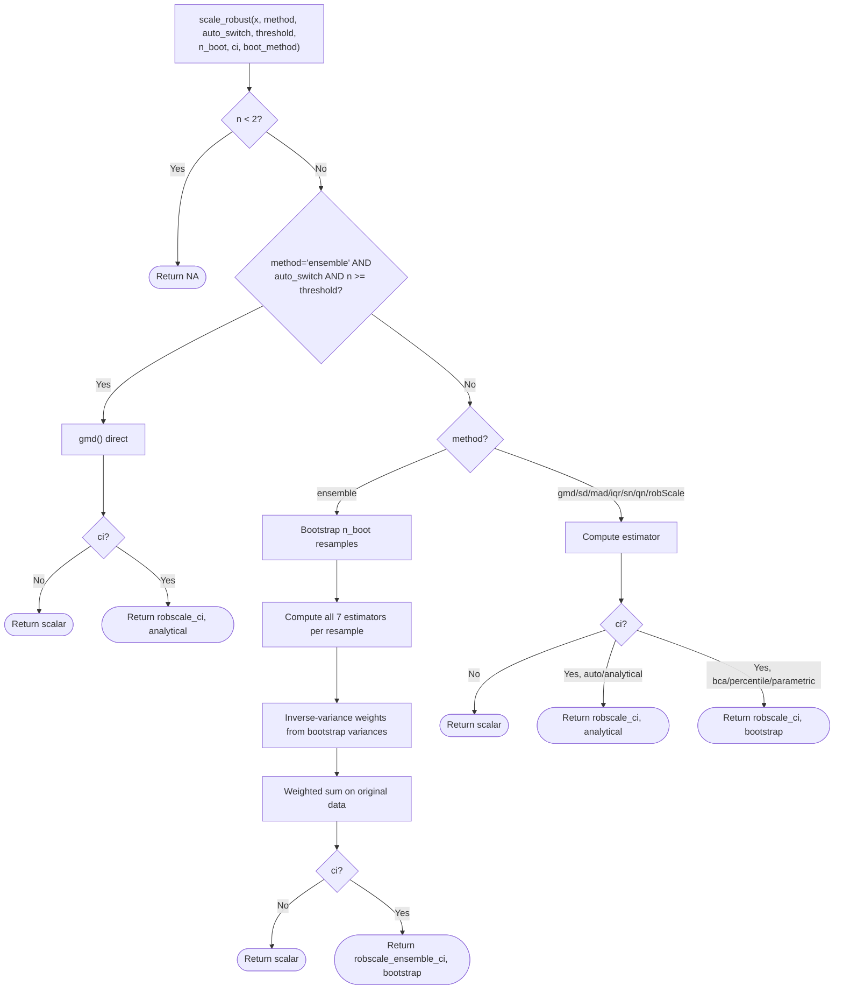
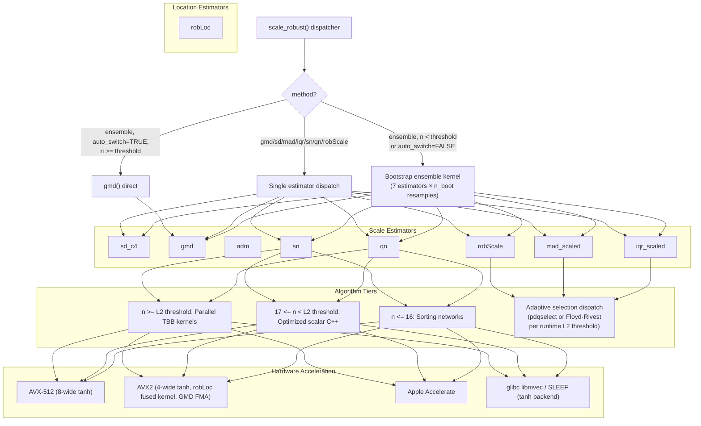

```{r}
#| label: setup
#| include: false
library(targets)
library(bench)
library(dplyr)
library(tidyr)
library(knitr)

# Helper to format speedups (without x)
format_speedup <- function(x) {
  if (is.null(x) || is.na(x)) return("—")
  sprintf("%.1f", x)
}

# Load benchmark results
tar_load(benchmark_report)

# Sanitize dataframes (unlist list-columns from targets/bench)
# M-estimators (revss)
m_analyzed <- benchmark_report$analyzed$leg_small %>%
  mutate(n = as.numeric(unlist(n)))

m_raw_rob <- benchmark_report$fast$m_estimators %>%
  mutate(n = as.numeric(unlist(n)), expr = as.character(expression))
m_raw_ref <- benchmark_report$legacy$revss %>%
  mutate(n = as.numeric(unlist(n)), expr = as.character(expression))

# Scale-estimators (robustbase)
s_analyzed <- benchmark_report$analyzed$leg_large %>%
  mutate(n = as.numeric(unlist(n)))

s_raw_rob <- benchmark_report$fast$scale_estimators %>%
  mutate(n = as.numeric(unlist(n)), expr = as.character(expression))
s_raw_ref <- benchmark_report$legacy$robustbase %>%
  mutate(n = as.numeric(unlist(n)), expr = as.character(expression))

# 3. New estimators (Panel C: robscale vs base R / existing implementations)
n_analyzed <- benchmark_report$analyzed$new_estimators %>%
  mutate(n = as.numeric(unlist(n)))
n_raw_rob <- benchmark_report$fast$new_estimators %>%
  mutate(n = as.numeric(unlist(n)), expr = as.character(expression))
n_raw_ref <- benchmark_report$legacy$new_estimators %>%
  mutate(n = as.numeric(unlist(n)), expr = as.character(expression))

# 0. Benchmark-time metadata (captured by run_benchmarks.R at build time)
bm_info  <- benchmark_report$fast$build_info      # compile flags, libraries, system
bm_pkgs  <- benchmark_report$legacy$pkg_versions  # competitor package versions

# Convenience aliases used in inline R throughout the document
pkg_version <- bm_info$pkg_version

# Helper to format speedup with CI
format_speedup_ci <- function(med, lo, hi) {
  if (is.na(med)) return("—")
  if (is.na(lo) || is.na(hi)) return(sprintf("**%sx**", format_speedup(med)))
  sprintf("**%sx** [%sx, %sx]", format_speedup(med), format_speedup(lo), format_speedup(hi))
}

# Helper to format durations (expects seconds)
format_duration <- function(s_val) {
  if (is.null(s_val) || is.na(s_val)) return("—")
  s_val <- as.numeric(s_val)
  if (s_val < 0.1) {
    sprintf("%.1f µs", s_val * 1e6)
  } else {
    sprintf("%.1f s", s_val)
  }
}

# 1. Processing M-estimators (Panel A: robscale (fast) vs revss)
# Per-estimator splits for accurate headline reporting
adm_analyzed  <- m_analyzed %>% filter(grepl("adm",      expr))
rLoc_analyzed <- m_analyzed %>% filter(grepl("robLoc",   expr))
rSc_analyzed  <- m_analyzed %>% filter(grepl("robScale", expr))

adm_target  <- adm_analyzed  %>% filter(n <= 20)
rLoc_target <- rLoc_analyzed %>% filter(n <= 20)
rSc_target  <- rSc_analyzed  %>% filter(n <= 20)

adm_speedup_min  <- format_speedup(min(adm_target$median_speedup,  na.rm = TRUE))
adm_speedup_max  <- format_speedup(max(adm_target$median_speedup,  na.rm = TRUE))
rLoc_speedup_min <- format_speedup(min(rLoc_target$median_speedup, na.rm = TRUE))
rLoc_speedup_max <- format_speedup(max(rLoc_target$median_speedup, na.rm = TRUE))
rSc_speedup_min  <- format_speedup(min(rSc_target$median_speedup,  na.rm = TRUE))
rSc_speedup_max  <- format_speedup(max(rSc_target$median_speedup,  na.rm = TRUE))

# NR-based estimators combined (robLoc + robScale) for the panel headline
m_nr_target   <- bind_rows(rLoc_target, rSc_target)
m_speedup_min <- format_speedup(min(m_nr_target$median_speedup, na.rm = TRUE))
m_speedup_max <- format_speedup(max(m_nr_target$median_speedup, na.rm = TRUE))

# adm at n>=128 (computation dominates over .Call overhead)
adm_large <- adm_analyzed %>% filter(n >= 128)
adm_large_min <- format_speedup(min(adm_large$median_speedup, na.rm = TRUE))
adm_large_max <- format_speedup(max(adm_large$median_speedup, na.rm = TRUE))

m_16k <- m_analyzed %>% filter(n == 16384)
m_16k_min <- format_speedup(min(m_16k$median_speedup))
m_16k_max <- format_speedup(max(m_16k$median_speedup))

# 2. Processing Scale-estimators (Panel B: robscale (fast) vs robustbase)
qn_analyzed <- s_analyzed %>% filter(expr == "qn")
sn_analyzed <- s_analyzed %>% filter(expr == "sn")

qn_speedup_min <- format_speedup(min(qn_analyzed$median_speedup))
qn_speedup_max <- format_speedup(max(qn_analyzed$median_speedup))

sn_speedup_min <- format_speedup(min(sn_analyzed$median_speedup))
sn_speedup_max <- format_speedup(max(sn_analyzed$median_speedup))

large_regime <- s_analyzed %>% filter(n >= 10000)
large_speedup_min <- format_speedup(min(large_regime$median_speedup))
large_speedup_max <- format_speedup(max(large_regime$median_speedup))

# Specific points for discussion
get_stat <- function(df, n_val, expr_val, col = "median_speedup") {
  val <- df %>% filter(n == n_val, expr == expr_val) %>% pull(!!sym(col))
  if (length(val) == 0) return(NA)
  val[1]
}

# Robust extraction of median time
get_med_time <- function(df, n_val, expr_val) {
  row <- df %>% filter(n == n_val, expr == expr_val)
  if (nrow(row) == 0) return(NA)
  median(as.numeric(unlist(row$time)))
}

qn_8_speedup <- format_speedup(get_stat(qn_analyzed, 8, "qn"))
qn_8_robscale <- format_duration(get_med_time(s_raw_rob, 8, "qn"))
qn_8_robustbase <- format_duration(get_med_time(s_raw_ref, 8, "qn"))

qn_10m_speedup <- format_speedup(get_stat(qn_analyzed, 10000000, "qn"))
qn_10m_robscale <- format_duration(get_med_time(s_raw_rob, 10000000, "qn"))
qn_10m_robustbase <- format_duration(get_med_time(s_raw_ref, 10000000, "qn"))

sn_10m_speedup <- format_speedup(get_stat(sn_analyzed, 10000000, "sn"))
sn_10m_robscale <- format_duration(get_med_time(s_raw_rob, 10000000, "sn"))
sn_10m_robustbase <- format_duration(get_med_time(s_raw_ref, 10000000, "sn"))

max_large_speedup <- format_speedup(max(s_analyzed$median_speedup))

# 3. Processing new estimators (Panel C)
gmd_hmisc <- n_analyzed %>% filter(expr == "gmd vs Hmisc")
gmd_gd <- n_analyzed %>% filter(expr == "gmd vs GiniDistance")
iqr_stats <- n_analyzed %>% filter(expr == "iqr_scaled vs stats")
iqr_collapse <- n_analyzed %>% filter(expr == "iqr_scaled vs collapse")
mad_stats <- n_analyzed %>% filter(expr == "mad_scaled vs stats")
mad_collapse <- n_analyzed %>% filter(expr == "mad_scaled vs collapse")

gmd_hmisc_min <- format_speedup(min(gmd_hmisc$median_speedup, na.rm = TRUE))
gmd_hmisc_max <- format_speedup(max(gmd_hmisc$median_speedup, na.rm = TRUE))
gmd_gd_min <- format_speedup(min(gmd_gd$median_speedup, na.rm = TRUE))
gmd_gd_max <- format_speedup(max(gmd_gd$median_speedup, na.rm = TRUE))
iqr_stats_min <- format_speedup(min(iqr_stats$median_speedup, na.rm = TRUE))
iqr_stats_max <- format_speedup(max(iqr_stats$median_speedup, na.rm = TRUE))
iqr_collapse_min <- format_speedup(min(iqr_collapse$median_speedup, na.rm = TRUE))
iqr_collapse_max <- format_speedup(max(iqr_collapse$median_speedup, na.rm = TRUE))
mad_stats_min <- format_speedup(min(mad_stats$median_speedup, na.rm = TRUE))
mad_stats_max <- format_speedup(max(mad_stats$median_speedup, na.rm = TRUE))
mad_collapse_min <- format_speedup(min(mad_collapse$median_speedup, na.rm = TRUE))
mad_collapse_max <- format_speedup(max(mad_collapse$median_speedup, na.rm = TRUE))
```

[](https://doi.org/10.5281/zenodo.18828607)

## Overview

`robscale` provides 11 exported functions spanning the full robustness--efficiency
spectrum: the bias-corrected standard deviation (`sd_c4`, 100% ARE), the Gini mean
difference (`gmd`, 98% ARE, 29.3% breakdown), the average deviation from the median
(`adm`, 88.3% ARE), the Rousseeuw--Croux estimators (`qn`, 82.3% ARE, `sn`, 58.2% ARE,
both 50% breakdown), the M-estimators (`robScale`, `robLoc`), and the computationally
light `iqr_scaled` and `mad_scaled`. The unified `scale_robust()` dispatcher
combines all 7 scale estimators in a variance-weighted bootstrap ensemble for small
samples ($n < 20$) and auto-switches to the GMD for larger ones. `get_consistency_constant()`
exposes the finite-sample bias-correction factors used throughout.

Against `revss`, `robscale` achieves
**`r rSc_speedup_min`--`r rSc_speedup_max`x** speedups for `robScale()` and
**`r rLoc_speedup_min`--`r rLoc_speedup_max`x** for `robLoc()` at small $n$,
with **`r adm_large_min`--`r adm_large_max`x** for `adm()` at $n \ge 128$.
Against `robustbase`, `qn` and `sn` run at
**`r qn_speedup_min`--`r qn_speedup_max`x** and
**`r sn_speedup_min`--`r sn_speedup_max`x** respectively, peaking near
**`r max_large_speedup`x** at $n = 10^7$ as TBB parallelism engages.
`gmd`, `iqr_scaled`, and `mad_scaled` beat their base R counterparts by
**`r gmd_hmisc_min`--`r gmd_hmisc_max`x**,
**`r iqr_stats_min`--`r iqr_stats_max`x**, and
**`r mad_stats_min`--`r mad_stats_max`x** respectively.

Speed comes from C++17 kernels with platform-specific SIMD vectorization, $O(n)$
selection algorithms, stack-allocated memory arenas, Newton--Raphson iteration for
both M-estimators, and Intel TBB parallelism for large datasets.

## Installation

```r
install.packages("robscale")

# Development version:
# install.packages("remotes")
# remotes::install_github("davdittrich/robscale")
```

## Motivating example

```r
library(robscale)

x <- c(2.0, 3.1, 2.7, 2.9, 3.3)   # clean measurements

# Recommended entry point: scale_robust()
scale_robust(x)                      # ensemble (small n < 20)
scale_robust(rnorm(50))              # auto-switches to gmd (n >= 20)

# Individual estimators span the robustness-efficiency frontier
gmd(x)                               # 98% ARE, 29.3% breakdown
qn(x)                                # 82.3% ARE, 50% breakdown
mad_scaled(x)                        # 36.8% ARE, 50% breakdown

# Confidence intervals --- analytical (default) or bootstrap
qn(x, ci = TRUE)                                               # analytical 95% CI
scale_robust(x, method = "qn", ci = TRUE, boot_method = "bca") # BCa bootstrap CI
gmd(x, ci = TRUE, level = 0.99)                                # 99% analytical CI

# Outlier resistance
x[5] <- 100                          # recording error
sd(x)                                # destroyed
gmd(x)                               # stable (29.3% breakdown)
qn(x)                                # stable (50% breakdown)
mad_scaled(x)                        # stable (50% breakdown)
```

## API reference

```{r}
#| label: tbl-api-scale
#| results: asis

# Extract speedup ranges for the table
format_speedup_range <- function(df, estimator_name) {
  sub_df <- df %>% filter(expr == estimator_name)
  if(nrow(sub_df) == 0) return("—")

  min_row <- sub_df[which.min(sub_df$median_speedup), ]
  max_row <- sub_df[which.max(sub_df$median_speedup), ]

  fmt <- function(r) {
    if (is.na(r$ci_low) || is.na(r$ci_high)) return(sprintf("**%.1fx**", r$median_speedup))
    sprintf("**%.1fx** [%.1fx, %.1fx]", r$median_speedup, r$ci_low, r$ci_high)
  }

  if (min_row$median_speedup == max_row$median_speedup) {
      return(fmt(min_row))
  }
  sprintf("%s to %s", fmt(min_row), fmt(max_row))
}

cat("**Table 1: Scale estimators** (sorted by decreasing ARE)\n\n")

api_data <- data.frame(
  Function = c(
    "`sd_c4(x)`",
    "`gmd(x)`",
    "`adm(x)`",
    "`qn(x)`",
    "`sn(x)`",
    "`robScale(x)`",
    "`iqr_scaled(x)`",
    "`mad_scaled(x)`"
  ),
  Purpose = c(
    "Bias-corrected standard deviation",
    "Gini mean difference",
    "Average deviation from median",
    "$Q_n$ scale estimator",
    "$S_n$ scale estimator",
    "M-estimate of scale",
    "Scaled interquartile range",
    "Scaled median absolute deviation"
  ),
  ARE = c("**100%**", "**98%**", "**88.3%**", "**82.3%**", "**58.2%**", "**55.0%**", "**37%**", "**36.8%**"),
  Breakdown = c("0%", "29.3%", "$1/n$", "50%", "50%", "50%", "25%", "50%"),
  Complexity = c("$O(n)$", "$O(n \\log n)$", "$O(n)$", "$O(n \\log n)$", "$O(n \\log n)$", "$O(n)$ iters", "$O(n)$", "$O(n)$"),
  Reference = c(
    "Welford (1962)",
    "Gini (1912); Nair (1936)",
    "Nair (1947)",
    "Rousseeuw & Croux (1993)",
    "Rousseeuw & Croux (1993)",
    "Rousseeuw & Verboven (2002)",
    "Bickel & Lehmann (1976)",
    "Rousseeuw & Croux (1993)"
  ),
  check.names = FALSE
)
knitr::kable(api_data)
```

ARE values are asymptotic under normality. The code constants used for
analytical CIs round to two decimal places (e.g., 0.82 for $Q_n$, 0.58
for $S_n$, 0.88 for ADM).

At the top of this spectrum, `sd_c4` retains full efficiency but collapses under
a single outlier. The `gmd` occupies the practical sweet spot: 98% efficiency
with 29.3% breakdown---sufficient for most contamination levels. For adversarial
settings where breakdown must be maximized, `qn` provides the best combination
of high breakdown (50%) and high efficiency (82.3%).

```{r}
#| label: tbl-api-dispatch
#| results: asis

cat("\n**Table 2: Dispatcher and utilities**\n\n")

dispatch_data <- data.frame(
  Function = c("`scale_robust(x)`", "`get_consistency_constant(method, n)`"),
  Purpose = c(
    "Unified dispatcher: ensemble for small $n$, auto-switches to GMD for large $n$",
    "Returns the consistency constant or finite-sample correction for a given estimator"
  ),
  check.names = FALSE
)
knitr::kable(dispatch_data)
```

Additionally, `robLoc(x)` provides an M-estimate of location (98.4% ARE, 50%
breakdown; Rousseeuw & Verboven 2002). All functions accept `na.rm` (default
`FALSE`). Most scale estimators accept `ci = FALSE` and `level = 0.95`; when
`ci = TRUE`, they return an object of class `"robscale_ci"` containing the point
estimate and a confidence interval (analytical for individual estimators,
bootstrap for `scale_robust()`). The exception is `robLoc()`,
which does not support confidence intervals.

### `sd_c4(x, na.rm = FALSE, ci = FALSE, level = 0.95)`

Computes the sample standard deviation corrected by $c_4(n)$ to remove the
small-sample bias of the square-root estimator:

$$
\hat\sigma = \frac{s}{c_4(n)} = \frac{s}{\sqrt{2/(n{-}1)} \cdot \Gamma(n/2) / \Gamma((n{-}1)/2)}
$$

where $s$ is the usual sample standard deviation. Uses Welford's online
algorithm for numerically stable variance computation, avoiding catastrophic
cancellation. This is a non-robust estimator (0% breakdown) with 100% ARE by
construction---it serves as the efficiency anchor in the ensemble.

```r
sd_c4(c(1, 2, 3, 5, 7, 8))
```

### `gmd(x, constant = 0.886226925452758, na.rm = FALSE, ci = FALSE, level = 0.95)`

Computes the Gini mean difference [@gini1912], scaled by a consistency
constant for asymptotic normality under the Gaussian model:

$$
\text{GMD}(x) = C \cdot \frac{2}{n(n{-}1)}\sum_{i=1}^{n} (2i - n - 1)\, x_{(i)}
$$

where $x_{(1)} \le \ldots \le x_{(n)}$ are the order statistics and
$C = \sqrt{\pi}/2 \approx 0.8862$. The computation requires a full sort
($(O(n \log n))$), with sorting networks applied for $n \le 16$.

The GMD achieves **98% ARE** [@nair1936] with a **29.3% breakdown point**,
making it the most statistically efficient robust alternative in this package.
It is the estimator `scale_robust()` auto-switches to for large samples.

```r
gmd(c(1, 2, 3, 5, 7, 8))
gmd(c(1, 2, 3, 5, 7, 8), constant = 1)   # raw (unscaled)
```

### `adm(x, center, constant = 1.2533141373155001, na.rm = FALSE, ci = FALSE, level = 0.95)`

Computes the mean absolute deviation from the median, scaled by a consistency
constant for asymptotic normality under the Gaussian model:

$$
\text{ADM}(x) = C \cdot \frac{1}{n}\sum_{i=1}^{n} |x_i - \text{med}(x)|
$$

where $C = \sqrt{\pi/2} \approx 1.2533$ [@nair1947]. When `center` is
supplied, it replaces the median. The ADM achieves **88.3% ARE** but breaks down at a single outlier
($1/n$ breakdown point). It serves as the fallback scale estimator when
the MAD collapses to zero.

```r
adm(c(1, 2, 3, 5, 7, 8))
adm(c(1, 2, 3, 5, 7, 8), constant = 1)   # without consistency correction
adm(c(1, 2, 3, 5, 7, 8), ci = TRUE)      # with 95% CI
```

### `robLoc(x, scale = NULL, na.rm = FALSE, maxit = 80L, tol = sqrt(.Machine$double.eps))`

M-estimator for location defined by the logistic psi function
[@rousseeuw2002, Eq. 21], solved via Newton--Raphson iteration. Starting value:
$T^{(0)} = \text{median}(x)$. Auxiliary scale: $S = \text{MAD}(x)$ (or the
user-supplied `scale`).

**Fallback logic:** When `scale` is unknown and $n < 4$, or when `scale` is
known and $n < 3$, the function returns `median(x)` without iteration.
Providing a known `scale` lowers the minimum sample size from 4 to 3 because the
MAD (which is unreliable at $n = 3$) is no longer needed.

```r
robLoc(c(1, 2, 3, 5, 7, 8))
robLoc(c(1, 2, 3), scale = 1.5)   # known scale enables n = 3
```

### `robScale(x, loc = NULL, fallback = c("adm", "na"), implbound = 1e-4, na.rm = FALSE, maxit = 80L, tol = sqrt(.Machine$double.eps), ci = FALSE, level = 0.95)`

M-estimator for scale solved by Newton--Raphson iteration on the M-scale
estimating equation $n^{-1}\sum\rho(u_i) = 1/2$ [@rousseeuw2002], where
$\rho(u) = \tanh^2(u)$ and $u_i = (x_i - T)/(2cS)$. Each NR step computes:

$$
\Delta S = S \cdot \frac{n^{-1}\sum\tanh^2(u_i) - \tfrac{1}{2}}{(2/n)\sum u_i\,\tanh(u_i)\,\text{sech}^2(u_i)}
$$

where $c = 0.37394112142347236$ and $T = \text{median}(x)$ is held fixed.
Starting value: $S^{(0)} = \text{MAD}(x)$. Convergence: $|\Delta S|/S \leq$
`tol`, typically 3--4 iterations.

**Degenerate input handling:** When the sample size falls below the minimum for
iteration (4 for unknown location, 3 for known), the function returns the
initial MAD-based scale directly if it is nonzero.  When the MAD collapses
to zero (i.e. MAD $\leq$ `implbound`), the `fallback` argument
controls the result:

- `fallback = "adm"` (Default): returns `adm(x)`, maintaining a finite
  robust estimate where standard scale measures fail.
- `fallback = "na"`: returns `NA`, strictly matching the behavioral profile of the `revss` package.

Providing a known `loc` centers the data at that value and uses the
median-distance-to-zero ($(1.4826 \cdot \text{median}(|x_i - \mu|))$) as the
initial scale, lowering the minimum sample size from 4 to 3.

```r
robScale(c(1, 2, 3, 5, 7, 8))
robScale(c(5, 5, 5, 5, 6), fallback = "na")   # returns NA (revss compatibility)
```

### `qn(x, constant = 2.2191, finite.corr = TRUE, na.rm = FALSE, ci = FALSE, level = 0.95)`

Computes the $Q_n$ estimator of scale [@rousseeuw1993]. Unlike
M-estimators, $Q_n$ requires no location estimate and achieves a 50% breakdown
point. `robscale` implements $Q_n$ with a tiered strategy: a brute-force exact
algorithm for small $n$ (below `qn_exact_threshold`) and a cache-aware
parallelized Johnson-style algorithm for larger samples.

```r
qn(c(1, 2, 3, 5, 7, 8))
qn(c(1, 2, 3, 5, 7, 8), ci = TRUE)   # with 95% CI
```

### `sn(x, constant = 1.1926, finite.corr = TRUE, na.rm = FALSE, ci = FALSE, level = 0.95)`

Computes the $S_n$ estimator of scale [@rousseeuw1993]. $S_n$ is more
statistically efficient than the MAD and maintains a 50% breakdown point.
`robscale` uses optimal sorting networks for $n \le 16$ and a highly
optimized parallelized inner-median algorithm for general samples.

```r
sn(c(1, 2, 3, 5, 7, 8))
sn(c(1, 2, 3, 5, 7, 8), ci = TRUE)   # with 95% CI
```

### `iqr_scaled(x, constant = 0.741301109252801, na.rm = FALSE, ci = FALSE, level = 0.95)`

Computes the interquartile range scaled by a consistency constant for
asymptotic normality under the Gaussian model:

$$
\text{IQR}_s(x) = C \cdot (Q_{0.75} - Q_{0.25})
$$

where $Q_p$ denotes the Type 7 quantile (R default) and
$C = 1/(\Phi^{-1}(0.75) - \Phi^{-1}(0.25)) \approx 0.7413$ [@bickel1976].
Unlike `stats::IQR()`, which requires a full $O(n \log n)$ sort, this
implementation uses dual $O(n)$ pdqselect calls---one per quartile---and
exploits the $Q_1$ partition to narrow the $Q_3$ search, providing a
substantial speedup for large datasets. The IQR achieves
**37% ARE** with a **25% breakdown point**.

```r
iqr_scaled(c(1, 2, 3, 5, 7, 8))
iqr_scaled(c(1, 2, 3, 5, 7, 8), constant = 1)   # raw IQR
```

### `mad_scaled(x, center, constant = 1.482602218505602, na.rm = FALSE, ci = FALSE, level = 0.95)`

Computes the median absolute deviation from the median, scaled by a consistency
constant for asymptotic normality:

$$
\text{MAD}_s(x) = C \cdot \text{med}_i\, |x_i - \text{med}(x)|
$$

where $C = 1/\Phi^{-1}(3/4) \approx 1.4826$. Unlike `stats::mad()`, this
implementation uses adaptive $O(n)$ selection (Floyd--Rivest below a
cache-derived threshold, pdqselect above) with sorting networks for $n \le 16$,
avoiding a full sort. The MAD achieves **36.8% ARE** [@rousseeuw1993, "about
37%"] with a **50% breakdown point**.

```r
mad_scaled(c(1, 2, 3, 5, 7, 8))
mad_scaled(c(1, 2, 3, 5, 7, 8), constant = 1)   # raw MAD
```

### `scale_robust(x, method = c("ensemble", "gmd", "sd", "mad", "iqr", "sn", "qn", "robScale"), auto_switch = TRUE, threshold = 20L, n_boot = 200L, na.rm = FALSE, ci = FALSE, level = 0.95, boot_method = c("auto", "analytical", "bca", "percentile", "parametric"))`

Unified dispatcher for robust scale estimation. Operates in three modes:

1. **Ensemble** (`method = "ensemble"`, $n <$ `threshold`): variance-weighted
   combination of all 7 scale estimators via bootstrap resampling.
2. **Auto-switched GMD** (`method = "ensemble"`, `auto_switch = TRUE`,
   $n \ge$ `threshold`): returns `gmd(x)` directly. Named methods (e.g.
   `method = "qn"`) are never intercepted by `auto_switch`---they always
   dispatch their own estimator regardless of $n$.
3. **Explicit method**: dispatches to a specific estimator by name.

When `ci = TRUE`: the ensemble returns a `robscale_ensemble_ci` object with a
bootstrap CI (`boot_method = "auto"` selects BCa for $n \le 200$, percentile
for $n \le 5000$, parametric otherwise). For named methods,
`boot_method = "auto"` or `"analytical"` returns an analytical interval
(chi-squared for `"sd"`, ARE-based normal approximation for all others);
`boot_method = "bca"`, `"percentile"`, or `"parametric"` returns a bootstrap
CI via `n_boot` resamples. `"analytical"` is not supported for
`method = "ensemble"`.

```r
scale_robust(c(1, 2, 3, 5, 7, 8))                               # ensemble (n < 20)
scale_robust(rnorm(50))                                          # auto-switches to gmd (n >= 20)
scale_robust(rnorm(50), auto_switch = FALSE)                     # forces ensemble at any n
scale_robust(rnorm(50), method = "qn")                           # explicit Qn (not intercepted by auto_switch)
scale_robust(c(1, 2, 3, 5, 7, 8), ci = TRUE)                    # ensemble + bootstrap CI
scale_robust(rnorm(50), method = "qn", ci = TRUE)                # Qn + analytical CI (default)
scale_robust(rnorm(50), method = "qn", ci = TRUE,
             boot_method = "bca")                                # Qn + BCa bootstrap CI
```



The ensemble combines: `sd_c4`, `gmd`, `mad_scaled`, `iqr_scaled`, `sn`, `qn`,
and `robScale`. Bootstrap resampling uses a deterministic XorShift32 PRNG
[@marsaglia2003] seeded deterministically from the replicate index, ensuring reproducible results
without requiring `set.seed()`.

Note: the method name `"sd"` maps to `sd_c4`.

### `get_consistency_constant(method, n = NULL)`

Returns the consistency constant (or finite-sample correction factor) used to
make a given estimator consistent for the population standard deviation under
normality. Supported `method` values: `"c4"`, `"gmd"`, `"mad"`, `"iqr"`, `"sn"`,
`"qn"`.

When `n = NULL`, the function returns the asymptotic consistency constant.
When `n` is supplied, it returns the finite-sample correction factor for that
sample size---useful for small-sample bias (for $n$) correction.

```r
get_consistency_constant("mad")          # asymptotic: 1/qnorm(3/4)
get_consistency_constant("qn", n = 10)  # finite-sample correction at n = 10
```

## Performance architecture

`robscale` achieves its speed gains through six cooperating mechanisms.

**SIMD vectorization.** The logistic psi function reduces to $\tanh(x/2)$,
dispatched to the fastest available platform backend: Apple Accelerate
(`vvtanh`) on macOS; glibc libmvec on Linux x86\_64, using the 8-wide AVX-512
kernel (`_ZGVeN8v_tanh`) when the CPU supports AVX-512F, otherwise the 4-wide
AVX2 kernel (`_ZGVdN4v_tanh`); SLEEF as a fallback when libmvec is absent; and
`#pragma omp simd` as a portable fallback. The Gini mean difference weighted
sum is vectorized separately via an AVX2 FMA kernel (`_mm256_fmadd_pd`) for
$n \geq 8$. For `robLoc()`, a fused AVX2 kernel accumulates $\psi_i$ and
$\text{d}\psi_i$ in a single pass over the data, reducing memory reads by 3$\times$
relative to the standard three-pass approach.

**$O(n)$ median selection.** Median and MAD computation uses optimal sorting networks
for $n \le 16$ (branchless compare-and-swap sequences, compiled to conditional-move
instructions at `-O2`), introselect for moderate $n$, and Floyd--Rivest at scale.
Each estimator chooses between Floyd--Rivest and pdqselect based on a runtime
crossover threshold derived from the per-core L2 cache size, minimizing cache pressure
for the specific working-set size of that estimator.

**Stack-allocated memory arenas.** A 128-double micro-buffer (1 KB) covers the
smallest samples ($n \leq 128$ for MAD, $n \leq 64$ for `robScale`/`robLoc`).
For $n \leq 2{,}048$, two stack-allocated arrays of 2,048 doubles each (32 KB
total) avoid heap allocation. `mad_scaled()` and `robScale()` use fused
single-buffer algorithms that compute median and absolute deviations in-place on
the same array, reducing cache pressure in the ensemble where multiple estimators
share working memory.

**Iteration convergence.** Both M-estimators use Newton--Raphson iteration
(quadratic convergence, 2--4 iterations), replacing the scoring fixed-point
method (~6--8 iterations). For `robLoc`, $\tanh$ values computed for the
numerator yield the denominator $\sum(1 - \psi_i^2) = \sum\text{sech}^2(u_i)$
via squaring and subtraction alone. For `robScale`, a fused single-pass kernel
computes $\sum\tanh^2(u_i)$ and $\sum u_i\tanh(u_i)\text{sech}^2(u_i)$
simultaneously---the NR numerator and denominator in one read over the data.
Loop-invariant quantities are hoisted before iteration and the reciprocal
constant $1/c$ is `constexpr`, replacing a division with multiplication.

**Parallelism and radix sorting.** The $Q_n$ and $S_n$ algorithms partition their
inner loops across Intel TBB threads for $n$ above a runtime L2-derived threshold,
scaling to all available cores. `cpp_scale_ensemble` evaluates all $7 \times
n_{\text{boot}}$ estimator calls in C++ without R overhead. Large-$n$ bootstrap
resamples are sorted with `boost::spreadsort::float_sort` (radix sort, $O(n)$
average), replacing the $O(n \log n)$ comparison sort. Bootstrap results are
stored in estimator-major layout ($7 \times n_{\text{boot}}$): each estimator's
replicates are contiguous in memory, so the mean/variance reduction pass reads at
stride-1 rather than stride-7. Within each replicate, a single sort is shared by
all seven estimators, and pre-allocated workspace buffers eliminate per-replicate
heap allocation for $S_n$ and $Q_n$.

**Numerical stability and build.** `sd_c4` uses Welford's one-pass algorithm for
numerically stable variance computation. Sorting-network entry points are instantiated
once in `src/sort_net_inst.cpp` and suppressed elsewhere via `extern template`,
reducing a cold 12-core build from approximately 300 s to 52 s.

## Architecture overview

`robscale` uses a tiered dispatch architecture to select the optimal algorithm
based on sample size and available hardware. The diagram below shows how `scale_robust()`
routes through the estimator hierarchy and how each estimator selects its
algorithm tier at runtime.



## Benchmarks

Figures 1 and 2 show speedup factors relative to reference implementations (Figure 1)
and absolute wall-clock run times (Figure 2) across sample sizes on a `r bm_info$cpu_name`
(`r bm_info$platform`, `r bm_info$r_version`, build flags: `` `r bm_info$cxx_flags` ``,
`tanh` backend: `r bm_info$tanh_backend`, TBB: `r bm_info$tbb_source`,
benchmarked `r bm_info$benchmark_date`).
Baseline packages: `robustbase` `r bm_pkgs$robustbase` [@maechler2026],
`revss` `r bm_pkgs$revss` [@adler2020],
`Hmisc` `r bm_pkgs$Hmisc` [@harrell2026],
`GiniDistance` `r bm_pkgs$GiniDistance` [@nguyen2022],
`collapse` `r bm_pkgs$collapse` [@krantz2025].

```{r}
#| label: fig-benchmarks
#| fig-cap: "Median speedup factor (x) vs. sample size $n$. Panel A compares `robLoc`, `robScale`, and `adm` against `revss`; Panel B compares `qn` and `sn` against `robustbase`; Panel C compares `gmd`, `iqr_scaled`, and `mad_scaled` against existing R implementations. The thin grey line at $y = 1$ marks parity with the reference."
knitr::include_graphics(tar_read(speedup_figure))
```

```{r}
#| label: fig-absolute-timings
#| fig-cap: "Median absolute run time for each robscale estimator across sample sizes (log--log scale). All estimators are measured on the same machine under identical conditions; the spread of lines reflects algorithmic complexity ($O(n)$, $O(n \\log n)$, $O(n^2)$) and the onset of TBB parallelism at large $n$."
knitr::include_graphics(tar_read(absolute_timing_figure))
```

### M-estimators (`adm`, `robLoc`, `robScale`)

`robScale()` and `robLoc()` reach **`r rSc_speedup_min`--`r rSc_speedup_max`x** and
**`r rLoc_speedup_min`--`r rLoc_speedup_max`x** over `revss` in the small-sample
regime ($n \le 20$). Newton--Raphson quadratic convergence (~3 iterations vs. 6--8),
the fused single-pass AVX2 kernel, stack-allocated arenas, and optimal sorting networks
for $n \le 16$ drive these gains. `adm()` matches `revss` at small $n$ (both ~1.5--2.0
µs, dominated by the R→C++ `.Call()` boundary) and leads by
**`r adm_large_min`--`r adm_large_max`x** at $n \ge 128$ as computation overtakes
boundary cost. At $n = 16{,}384$, all three NR estimators retain
**`r m_16k_min`--`r m_16k_max`x** gains because `revss` interpreter overhead scales
with iteration count, not just vector length.

### Rousseeuw--Croux estimators (`qn`, `sn`)

```{r}
#| label: tbl-qn-bench
#| results: asis

qn_table_data <- qn_analyzed %>%
  filter(n %in% c(8, 16, 64, 1024, 65536, 10000000)) %>%
  rowwise() %>%
  mutate(
    rob_time = format_duration(get_med_time(s_raw_rob, n, "qn")),
    ref_time = format_duration(get_med_time(s_raw_ref, n, "qn")),
    Speedup = sprintf("**%.1fx**", median_speedup)
  ) %>%
  ungroup() %>%
  select(n, `robustbase::Qn` = ref_time, `robscale::qn` = rob_time, Speedup)

knitr::kable(qn_table_data, col.names = c("$n$", "`robustbase::Qn`", "`robscale::qn`", "Speedup"))
```

```{r}
#| label: tbl-sn-bench
#| results: asis

sn_table_data <- sn_analyzed %>%
  filter(n %in% c(8, 16, 64, 1024, 65536, 10000000)) %>%
  rowwise() %>%
  mutate(
    rob_time = format_duration(get_med_time(s_raw_rob, n, "sn")),
    ref_time = format_duration(get_med_time(s_raw_ref, n, "sn")),
    Speedup = sprintf("**%.1fx**", median_speedup)
  ) %>%
  ungroup() %>%
  select(n, `robustbase::Sn` = ref_time, `robscale::sn` = rob_time, Speedup)

knitr::kable(sn_table_data, col.names = c("$n$", "`robustbase::Sn`", "`robscale::sn`", "Speedup"))
```

For small to medium $n$, `robscale` leads by **`r qn_speedup_min`--`r qn_speedup_max`x**
for `qn` and **`r sn_speedup_min`--`r sn_speedup_max`x** for `sn`, primarily from
eliminating R dispatch overhead and using stack memory. At $n = 10^7$, `qn` runs in
`r qn_10m_robscale` vs. `r qn_10m_robustbase` (**`r qn_10m_speedup`x**) and `sn` in
`r sn_10m_robscale` vs. `r sn_10m_robustbase` (**`r sn_10m_speedup`x**), as TBB
parallelism scales across cores.

### Single-pass estimators (`gmd`, `iqr_scaled`, `mad_scaled`)

```{r}
#| label: tbl-new-bench
#| results: asis

# Show selected n values for the new estimator comparisons
new_table <- n_analyzed %>%
  filter(n %in% c(64, 1024, 65536, 10000000)) %>%
  select(n, expr, median_speedup) %>%
  mutate(Speedup = sprintf("**%.1fx**", median_speedup)) %>%
  select(n, Comparison = expr, Speedup) %>%
  arrange(n, Comparison)

knitr::kable(new_table, col.names = c("$n$", "Comparison", "Speedup"))
```

`gmd` beats `Hmisc::GiniMd` by **`r gmd_hmisc_min`--`r gmd_hmisc_max`x** (C++ vs. pure
R) and `GiniDistance::gmd` by **`r gmd_gd_min`--`r gmd_gd_max`x** (both compiled, with
`robscale`'s edge from sorting networks). `iqr_scaled` leads `stats::IQR` by
**`r iqr_stats_min`--`r iqr_stats_max`x** (dual $O(n)$ pdqselect vs. full sort) and
`collapse::fquantile` by **`r iqr_collapse_min`--`r iqr_collapse_max`x**.
`mad_scaled` leads `stats::mad` by **`r mad_stats_min`--`r mad_stats_max`x** and a
`collapse::fmedian`-based MAD by **`r mad_collapse_min`--`r mad_collapse_max`x**
(adaptive $O(n)$ selection vs. sorting).

> [!NOTE]
> **Source builds recommended.** Installing from source (`install.packages("robscale", type = "source")`)
> enables the `configure` script to detect SIMD capabilities (AVX-512/AVX2/FMA on x86_64, NEON on ARM64)
> and link platform-specific libraries (Apple Accelerate, glibc libmvec, SLEEF). Pre-built CRAN binaries
> use portable settings and may not include these optimizations. Parallelism thresholds
> are derived from the detected per-core L2 cache size at runtime on all platforms.
> For maximum performance, add the following to `~/.R/Makevars` before installing:
> ```
> CXXFLAGS = -O2 -march=native -mtune=native
> ```

## Numerical equivalence

The test suite verifies `robscale` against reference implementations:

**M-estimator cross-check** (`tests/testthat/test-cross-check.R`): For `adm`, 1,800 randomly generated inputs ($n = 3, \ldots, 20$; 100 replicates) pass at tolerance $10^{-4}$. For `robLoc` and `robScale`, comparisons against `revss` $\leq$ 2.0.0 also pass at $10^{-4}$; `revss` $\geq$ 3.0.0 changed its bias-correction constants, so these comparisons are version-gated. `robscale` follows the @rousseeuw2002 estimating equations and constants but solves them via Newton--Raphson.

**Other estimators:**

- `gmd`: exact match with the R formula $C \cdot 2/(n(n-1)) \sum (2i - n - 1) x_{(i)}$ (`test-gmd.R`)
- `iqr_scaled`: matches `IQR(x) * 0.741301109252801` (`test-iqr.R`)
- `mad_scaled`: matches `stats::mad(x)` (`test-mad-scaled.R`)
- `sd_c4`: matches `sd(x) / c4(n)` (`test-sd-c4.R`)
- `scale_robust` ensemble: deterministic via fixed XorShift32 seeds (`test-ensemble.R`, `test-scale-robust.R`)

The Newton--Raphson iteration converges to the same fixed point as the scoring
iteration---it solves the same estimating equation---so results differ only by
rounding at the level of the convergence tolerance.

## Mathematical background

Full mathematical derivations, key constants, and algorithmic proofs are in
`vignette("robscale-intro")`.

## Relation to revss and robustbase

This package re-implements the M-estimators from the 'revss' package
[@adler2020] and the $Q_n$ and $S_n$ estimators from 'robustbase'
[@maechler2026].

The API for the M-estimators is intentionally identical to `revss`: `adm()`,
`robLoc()`, and `robScale()` accept the same arguments and return the same values.
Code that uses `revss` can switch to `robscale` by changing only the `library()` call.

For `qn()` and `sn()`, the function signatures match `robustbase::Qn()` and
`robustbase::Sn()` (with lowercase names for consistency).

Benchmark comparisons apply Fisher-consistency scaling where needed:
`gmd()` is compared against `Hmisc::GiniMd(x) * 0.8862` and `GiniDistance::gmd(x) * 0.8862`;
`iqr_scaled()` against `stats::IQR(x) * 0.7413` and scaled `collapse::fquantile()` arrays;
and `mad_scaled()` directly against `stats::mad()` and a `collapse::fmedian()` equivalent,
since `stats::mad()` already applies the 1.4826 factor.

Users who do not need compiled performance---or who prefer a dependency-free
pure-R package---should use `revss` or `robustbase` directly. Both are mature,
well-tested, and widely available.

## Author

Dennis Alexis Valin Dittrich
([ORCID](https://orcid.org/0000-0002-4438-8276))

## License

MIT. Copyright 2026 Dennis Alexis Valin Dittrich.
